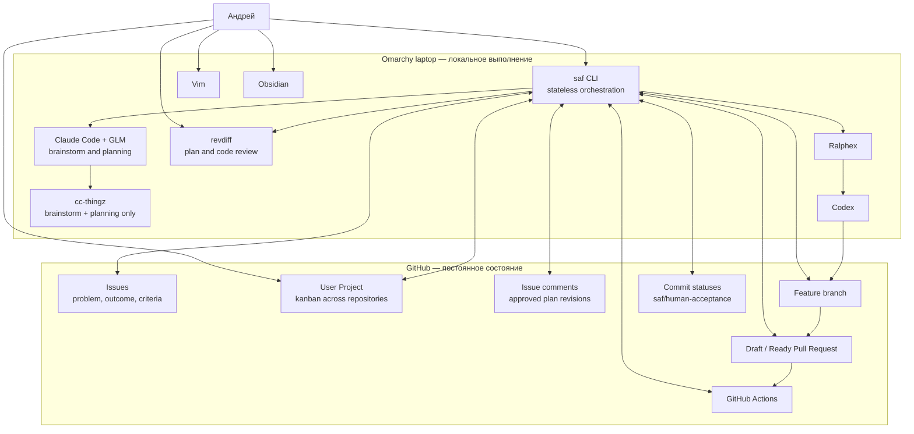
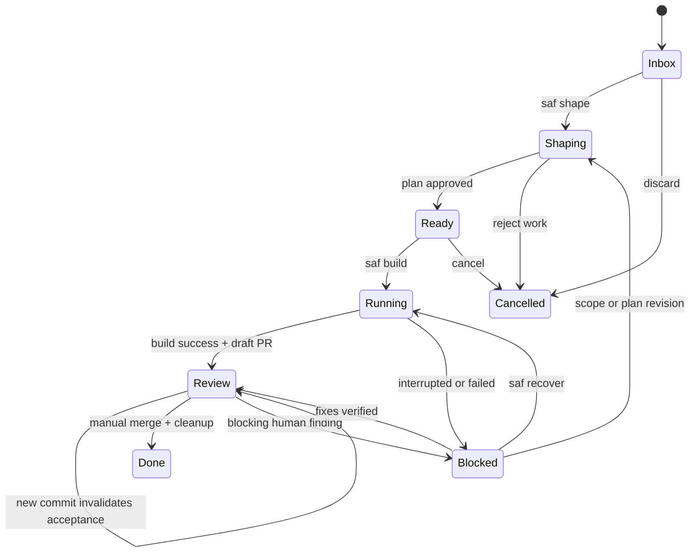

# EPIC-LAW-001 — Local-first Agent Development Workflow

**Статус:** Proposed / готов к декомпозиции и пилотному внедрению  
**Владелец:** Андрей  
**Дата фиксации:** 10 июля 2026  
**Основная рабочая машина:** ноутбук с Omarchy OS  
**Source of truth:** GitHub Issues, GitHub Project, Git и Pull Request  
**Planning agent:** Claude Code + GLM  
**Основной coding agent:** Codex  
**Оркестратор исполнения:** Ralphex  
**Интерфейс обязательного review:** revdiff  
**Локальный оркестратор и официальный CLI:** `saf`  
**Постоянный сервер:** не требуется  
**Локальная база данных:** не используется  

---

## 1. Резюме эпика

Нужно внедрить локальный, воспроизводимый и достаточно строгий процесс агентной разработки, который устраняет основные дефекты текущего workflow:

- задача начинается с идеи, но не всегда имеет проверяемый продуктовый результат;
- хороший технический план создаётся, но его review легко пропустить;
- Ralphex и Codex выполняют работу, однако окончание агента ошибочно воспринимается как готовность результата;
- код сливается в `main` или `master` без обязательной человеческой приёмки;
- планы, ADR и документация накапливаются, но не формируют понятную текущую картину проекта;
- отдельные задачи могут быть реализованы качественно, а проект в целом постепенно теряет целостность;
- все переходы между стадиями выполняются вручную и зависят от памяти и мотивации владельца.

Целевая система не должна требовать Mattermost, OpenClaw, отдельного сервера, Docker Compose, очереди заданий или собственной постоянной базы данных.

Вместо этого вводится тонкий локальный CLI `saf`, который:

1. читает состояние из GitHub и Git;
2. запускает существующий Claude Code + GLM для brainstorm и planning;
3. требует review и утверждение точной revision плана;
4. запускает Ralphex с Codex;
5. создаёт или обновляет Draft Pull Request;
6. автоматически открывает человеческий review через revdiff;
7. собирает acceptance evidence — доказательства выполнения критериев приёмки;
8. публикует commit status `saf/human-acceptance` только после завершения review;
9. не выполняет merge;
10. регулярно инициирует whole-project health review — проверку проекта целиком.

Целевая формула:

> **GitHub хранит работу и состояние. GLM помогает сформулировать правильную задачу и план. Ralphex управляет автономным исполнением. Codex пишет и проверяет код. revdiff делает человеческий review дешёвым. `saf` не хранит собственную бизнес-историю, а гарантирует порядок переходов. Человек утверждает план, принимает поведение и выполняет merge.**

---

## 2. Контекст и исходная проблема

### 2.1. Текущий workflow

```text
Открыть проект в Vim
→ открыть Claude Code с GLM
→ вручную вызвать brainstorm
→ вручную вызвать planning:make
→ иногда задать Codex дополнительные вопросы
→ необязательно посмотреть план
→ вручную запустить Ralphex
→ дождаться реализации
→ необязательно посмотреть diff
→ слить изменения в main/master
→ начать следующую задачу
```

Из устойчивых артефактов остаются:

- код;
- Git-история;
- завершённый plan-файл;
- иногда документация;
- иногда ADR — Architecture Decision Record, запись архитектурного решения.

Не остаются в обязательной и структурированной форме:

- точная исходная проблема;
- desired outcome — желаемый наблюдаемый результат;
- non-goals — сознательно исключённый scope;
- доказательства выполнения acceptance criteria;
- человеческое решение о качестве результата;
- причины отклонения от плана;
- текущий список главных проблем проекта;
- регулярная оценка продукта и архитектуры целиком.

### 2.2. Корневая причина

Проблема не в отсутствии coding agent и не в недостаточной автономности.

Текущий стек уже способен:

- исследовать код;
- обсуждать решение;
- создавать подробные планы;
- выполнять задачи;
- писать тесты;
- проводить автоматический review;
- создавать коммиты.

Корневая причина — отсутствие обязательной state machine, то есть конечного автомата состояний, который физически и процедурно разделяет:

```text
Идея
Понятная задача
Утверждённый план
Выполненная реализация
Проверенный результат
Принятое изменение
```

### 2.3. Основной анти-паттерн

```text
Agent finished ≠ Work accepted
```

Окончание Ralphex означает только:

> Исполнитель завершил предусмотренный им цикл.

Оно не означает:

- задача решает правильную проблему;
- scope не расползся;
- пользовательский сценарий действительно удобен;
- архитектурная цена приемлема;
- документация отражает текущее состояние;
- результат следует включать в продукт.

### 2.4. Почему добровольные проверки не работают

Любой этап, который требует отдельно вспомнить команду и принять решение «нужно ли сейчас это делать», со временем становится необязательным.

Поэтому:

- plan review должен автоматически следовать за созданием плана;
- code review должен автоматически следовать за выполнением;
- merge должен быть технически заблокирован без acceptance status;
- health review должен становиться due — просроченным — по измеримому правилу.

---

## 3. Принятые решения

| ID | Решение | Обоснование |
|---|---|---|
| D-01 | Использовать GitHub Issues как канонические work items | Задачи доступны с телефона и любого компьютера, связаны с кодом и не требуют собственного сервера. |
| D-02 | Использовать отдельный GitHub Project для каждого repository и хранить явную привязку в `<repo>/.saf/config.yaml` | Repository является изолированным workflow context; CLI не должен перечислять или обслуживать другие repositories и Projects пользователя. |
| D-03 | Не использовать Mattermost в первой версии | Он не решает непосредственную проблему качества переходов и существенно увеличивает стоимость внедрения. |
| D-04 | Не использовать OpenClaw в первой версии | Текущий Claude Code + GLM уже закрывает planning; сначала нужно стабилизировать процесс, а не менять runtime. |
| D-05 | Не использовать собственную постоянную базу данных | Каноническое состояние уже хранится в GitHub, Git, Pull Request и commit statuses. |
| D-06 | Реализовать stateless orchestration | `saf` при каждом запуске восстанавливает состояние из внешних источников; локальные cache и logs можно удалить без потери work item. |
| D-07 | Оставить `cc-thingz` для `/brainstorm:do` и `/planning:make` на пилотный период | Эти части текущего workflow уже полезны; менять одновременно методику и orchestration рискованно. |
| D-08 | Запретить `/planning:exec` в каноническом pipeline | Исполнение и автоматический review принадлежат Ralphex, иначе появляются два конкурирующих execution loop. |
| D-09 | Использовать revdiff как обязательный интерфейс plan и code review | Review должен открываться автоматически и позволять оставлять inline-аннотации в терминале. |
| D-10 | Использовать Ralphex с нативным Codex executor | Codex является основным coding agent и должен выполнять task-loop и review через один оркестратор. |
| D-11 | Использовать full Ralphex mode для Standard и High-risk задач | Такие изменения требуют автоматических review-фаз, а не только task execution. |
| D-12 | Использовать `--tasks-only` только для явно классифицированных Fast-задач | Маленькие изменения могут иметь сокращённый цикл, но всё равно проходят CI и human acceptance. |
| D-13 | После build автоматически создавать Draft Pull Request | Pull Request становится долговечным review packet, запускает CI и фиксирует связь с Issue. |
| D-14 | Merge всегда остаётся ручным | Локальный инструмент не получает команды auto-merge и не принимает продуктовое решение. |
| D-15 | Публиковать `saf/human-acceptance` для текущего commit SHA | Новый commit автоматически требует повторной человеческой приёмки, поскольку status привязан к точному SHA. |
| D-16 | Защитить default branch обязательным Pull Request и required checks, когда GitHub-тариф это позволяет | Правильный процесс должен быть технически проще обойти только сознательно, а не случайно. |
| D-17 | В solo mode не требовать GitHub approval другого пользователя | Автор не может заменить человеческую приёмку формальным внешним reviewer; отдельный commit status лучше отражает реальный gate. |
| D-18 | Хранить активный implementation plan временно | После merge из плана извлекаются долговечные знания, затем plan удаляется по умолчанию. |
| D-19 | Добавить `PROJECT.md` как текущий продуктовый контракт | Каждый brainstorm должен начинаться не только с кода, но и с цели, принципов и текущих проблем проекта. |
| D-20 | Хранить проектную документацию рядом с кодом и открывать `docs/` в Obsidian | Документы проходят Git review и остаются доступны в привычном интерфейсе. |
| D-21 | Существующую PKM-базу оставить отдельной | В неё попадают только переносимые между проектами знания и retrospective, а не каждый task artifact. |
| D-22 | Ввести обязательный whole-project health review | Локальная оптимизация отдельных задач не должна заменять оценку продукта и архитектуры целиком. |
| D-23 | На первом этапе разрешить только один активный implementation run | Это ограничивает WIP — Work In Progress, объём незавершённой работы — и снижает review backlog. |
| D-24 | Не покупать новое оборудование для этого эпика | Процесс должен полностью работать на текущем Omarchy-ноутбуке. |
| D-25 | Сохранить self-hosted platform epic как возможную следующую фазу | Удалённое 24/7 выполнение решается только после доказательства ценности локального процесса. |

---

## 4. Цели

### G-01. Сделать правильный путь самым коротким

Обычная задача должна проходить через несколько понятных команд:

```bash
saf shape 42
saf build 42
saf review 42
saf ship 42
```

Не должно требоваться вспоминать:

- какой skill вызвать;
- где находится plan;
- проверялся ли он;
- какая команда Ralphex нужна;
- создан ли Pull Request;
- прошёл ли CI;
- выполнялась ли человеческая приёмка.

### G-02. Исключить merge без явной приёмки

Default branch не должен принимать последний commit Pull Request, пока для его SHA не существуют:

- успешный CI;
- успешный `saf/human-acceptance`.

### G-03. Сохранить полезные текущие инструменты

В первой версии не требуется заменять:

- Vim;
- Claude Code;
- GLM;
- Codex;
- Ralphex;
- `cc-thingz`;
- Obsidian;
- GitHub.

Новая система связывает их, а не создаёт ещё один полноценный agent framework.

### G-04. Изолировать каждый repository context

Одна системная установка `saf` может использоваться в разных repositories, но каждый запуск работает только с текущим Git repository, одним настроенным GitHub repository и одним GitHub Project из `.saf/config.yaml`.

CLI не содержит глобального каталога проектов, не перечисляет другие repositories или Projects пользователя и не предоставляет cross-repository inbox.

### G-05. Быть monorepo-friendly

Одна связанная fullstack-задача в монорепозитории проходит как:

```text
один Issue
→ один approved plan
→ одна feature branch
→ один Ralphex run
→ один Draft Pull Request
→ один acceptance decision
```

### G-06. Уменьшить стоимость review

Human review должен начинаться с готового review packet:

- что изменилось;
- какие acceptance criteria заявлены;
- какие файлы наиболее рискованны;
- какие команды прошли;
- что нужно проверить руками;
- какие ограничения остались.

### G-07. Управлять документационной энтропией

После merge не должны бесконтрольно накапливаться:

- завершённые планы;
- повторяющие друг друга architecture docs;
- ADR для тривиальных решений;
- одноразовые agent reports.

### G-08. Проверять проект целиком

Не реже одного раза на пять merge или раз в две недели должна выполняться оценка:

- продуктовой цели;
- core workflows;
- архитектурной сложности;
- согласованности интерфейса;
- тестовых пробелов;
- устаревших документов;
- текущих top problems.

### G-09. Обеспечить восстановление после прерывания

После закрытия терминала, reboot или ошибки:

- Issue не теряется;
- approved plan можно восстановить из GitHub;
- branch и commits сохраняются;
- Ralphex можно продолжить;
- повторная команда не создаёт дублирующий Pull Request.

### G-10. Измерить, улучшает ли процесс результат

После пилота на десяти задачах должны быть доступны данные:

- сколько планов пришлось пересматривать;
- сколько scope violations найдено;
- сколько review-итераций потребовалось;
- сколько прямых merge было предотвращено;
- сколько completed plans удалено;
- как часто health review менял приоритеты.

---

## 5. Non-goals

В первую стабильную версию не входят:

- Mattermost;
- OpenClaw;
- Plane, Jira, Linear или локальная kanban-система;
- собственный web-интерфейс;
- фоновый daemon;
- очередь распределённых jobs;
- выполнение при выключенном ноутбуке;
- auto-merge;
- production deployment;
- локальный LLM;
- одновременное выполнение нескольких тяжёлых agent jobs;
- полноценный sandbox для каждого проекта;
- Kubernetes;
- Docker-first execution как обязательное требование;
- сохранение полных agent transcripts в Git;
- автоматическая публикация в личную PKM;
- полный gstack sprint поверх Ralphex;
- автоматическое исправление всех human review annotations без подтверждения;
- обязательная поддержка Windows;
- единый общий Obsidian vault, содержащий несколько вложенных Git-репозиториев;
- попытка сделать все прошлые планы долговечной документацией;
- автоматическое принятие продуктовых решений моделью.

---

## 6. Критерии успеха пилота

Пилот считается успешным после десяти реальных задач, если выполнены все условия:

1. Ни один feature или bug fix не попал в default branch прямым push.
2. У каждой задачи до build существовали:
   - problem;
   - desired outcome;
   - non-goals;
   - acceptance criteria.
3. Для каждой Standard/High-risk задачи существовал approved plan hash.
4. Каждый plan был открыт в revdiff хотя бы один раз.
5. Каждый implementation diff был открыт в revdiff.
6. Для каждого merge существовал status `saf/human-acceptance` на последнем SHA.
7. Для каждого Pull Request существовал CI result.
8. Completed implementation plans не остались в active-папке.
9. Не было двух одновременно активных implementation runs.
10. Был выполнен минимум один whole-project health review.
11. `PROJECT.md` был обновлён минимум один раз на основании фактического состояния проекта.
12. В backlog появлялись задачи, созданные health review, а не только спонтанными идеями.
13. Повторный запуск любой основной команды не создавал дублирующий Issue, branch или Pull Request.
14. Как минимум одна искусственно прерванная задача была успешно восстановлена.
15. Владелец субъективно оценил review cost как приемлемый, а не как отдельный большой ритуал.

### 6.1. Базовые метрики

До начала пилота зафиксировать ориентировочные значения:

| Метрика | Текущий baseline |
|---|---|
| Доля задач с просмотренным планом | Низкая / не измеряется |
| Доля задач с человеческим code review | Низкая / не измеряется |
| Доля изменений через Pull Request | Непостоянная |
| Доля задач с acceptance criteria | Непостоянная |
| Количество active/completed plans | Не контролируется |
| Частота project-level review | Практически отсутствует |
| Прямые merge/push в default branch | Возможны |
| Среднее число незавершённых задач | Не контролируется |

После десяти задач сравнить baseline и фактический результат.

---

## 7. Принципы системы

### P-01. Состояние должно находиться рядом с предметом

| Сущность | Каноническое место |
|---|---|
| Связь repository ↔ GitHub Project | `.saf/config.yaml` |
| Задача | GitHub Issue |
| Backlog текущего repository | Привязанный GitHub Project |
| Текущая цель проекта | `PROJECT.md` |
| Правила агента | `AGENTS.md` |
| Approved plan | GitHub Issue comment + SHA-256 |
| Рабочая копия плана | feature branch |
| Код | Git branch |
| Review | Draft Pull Request + revdiff |
| CI | GitHub Actions |
| Human acceptance | commit status на текущем SHA |
| Архитектура | актуальные Markdown docs |
| Значимое решение | ADR |
| Cross-project вывод | личная PKM |

### P-02. Оркестратор не является источником истины

`saf` может хранить:

- cache;
- локальные logs;
- временные файлы;
- lock-файлы;
- последние выбранные настройки.

Удаление этих данных не должно делать невозможным:

- определить статус задачи;
- восстановить plan;
- найти branch;
- найти Pull Request;
- продолжить работу.

### P-03. Новый commit инвалидирует acceptance

Human acceptance относится к конкретному Git SHA.

После любого изменения branch head:

```text
старый saf/human-acceptance
→ больше не применим
→ review требуется заново
```

### P-04. Профиль меняет глубину, а не инструменты

Fast, Standard и High-risk используют тот же lifecycle.

Отличаются:

- глубина shaping;
- наличие отдельного plan review;
- Ralphex mode;
- объём CI;
- объём ручной проверки;
- требования к ADR и rollback.

### P-05. План временный, знание долговечное

Implementation plan должен помогать выполнить изменение.

После merge:

- актуальные правила переходят в текущую документацию;
- значимые trade-offs переходят в ADR;
- одноразовая последовательность действий удаляется.

### P-06. Автоматический review не заменяет приёмку владельца

Ralphex и Codex проверяют реализацию.

Владелец проверяет:

- соответствует ли результат проблеме;
- нравится ли поведение;
- допустима ли сложность;
- нужно ли это изменение проекту.

### P-07. Whole-project review важнее бесконечного backlog grooming

Список следующих задач должен периодически формироваться из анализа проекта целиком, а не только из потока новых идей.

### P-08. Минимум скрытой магии

Каждая команда должна:

- печатать выполняемые внешние команды;
- поддерживать `--dry-run`;
- объяснять, почему переход запрещён;
- не выполнять destructive action без явного подтверждения;
- сохранять понятный audit comment в GitHub.

---

## 8. Целевая архитектура



### 8.1. Канонический lifecycle

```text
Inbox
→ Shaping
→ Ready
→ Running
→ Review
→ Done
```

Вспомогательные состояния:

```text
Blocked
Cancelled
```

### 8.2. Канонический маршрут задачи

```text
GitHub Issue
→ GLM brainstorm
→ structured Issue
→ GLM implementation plan
→ automatic plan review
→ revdiff human plan review
→ exact plan hash approval
→ Ralphex + Codex
→ Draft Pull Request
→ CI
→ revdiff human code review
→ acceptance checklist
→ saf/human-acceptance
→ manual merge
→ documentation cleanup
→ Done
```

---

## 9. Источники истины и минимальное состояние

### 9.1. GitHub Issue

Issue содержит текущий work contract:

- problem;
- desired outcome;
- non-goals;
- acceptance criteria;
- risk profile;
- ссылки на plan revision;
- ссылки на branch и Pull Request;
- structured event comments.

### 9.2. GitHub Project

Привязанный Project содержит workflow-представление только текущего repository:

- Status;
- Priority;
- Risk;
- Type;
- Area;
- Target;
- связи с Issue и Pull Request.

Project Status не является самостоятельным доказательством готовности. `saf` выводит effective state из Issue, approved plan, Git, Pull Request, CI и human acceptance, сравнивает его с Project Status и сообщает о drift. Успешная команда обновляет Status только после прохождения transition guards.

### 9.3. Git

Git содержит:

- рабочую ветку;
- implementation changes;
- plan progress во время Ralphex;
- test changes;
- documentation changes;
- историю восстановления.

### 9.4. Pull Request

Pull Request содержит:

- итоговый review packet;
- связь с Issue;
- CI;
- human acceptance comment;
- обсуждение отклонений;
- решение о merge.

### 9.5. Commit status

Commit status `saf/human-acceptance` содержит gate для конкретного SHA:

```text
pending  — review начат, но не завершён
success  — acceptance checklist пройден
failure  — review выявил blocking findings
error    — review не удалось выполнить технически
```

### 9.6. Локальные данные

Допустимы:

```text
~/.config/saf/
~/.cache/saf/
~/.local/state/saf/
<repo>/.saf/runtime/
```

Их назначение:

- configuration;
- API ID cache;
- command logs;
- temporary review packet;
- process lock;
- recovered plan copy.

Они не являются канонической записью workflow.

---

## 10. Акторы и ответственности

### 10.1. Human Owner

Только владелец может:

- принять product framing;
- утвердить plan revision;
- разрешить scope change;
- принять human review;
- решить, что результат нравится;
- выполнить merge;
- решить судьбу документации;
- обновить приоритеты проекта;
- снять или изменить процессные gates.

### 10.2. GLM Planner

GLM используется через Claude Code для:

- brainstorm;
- product shaping;
- exploration альтернатив;
- investigation;
- implementation planning;
- plan revision;
- product/outcome review;
- project health review;
- retrospective.

GLM не является каноническим coding executor.

### 10.3. Codex Executor

Codex используется для:

- реализации approved plan;
- тестов;
- исправления validation failures;
- Ralphex review phases;
- целевых исправлений после human annotations;
- технических консультаций по запросу.

### 10.4. Ralphex

Ralphex отвечает за:

- создание feature branch;
- последовательное выполнение plan tasks;
- fresh context на каждую task;
- автоматические commits;
- review phases;
- retry;
- progress tracking;
- resume после прерывания.

### 10.5. revdiff

revdiff отвечает за:

- интерактивный plan review;
- code diff review;
- inline annotations;
- низкую стоимость повторного review;
- единый терминальный интерфейс проверки.

### 10.6. `saf`

`saf` отвечает за:

- чтение и валидацию состояния;
- запуск правильного инструмента;
- state transition guards;
- GitHub Project updates;
- plan revision и hash;
- idempotency;
- Draft Pull Request;
- review packet;
- human acceptance status;
- cleanup;
- health-review cadence.

`saf` не принимает продуктовые решения и не делает merge.

---

## 11. State machine

### 11.1. Состояния

| State | Значение |
|---|---|
| `Inbox` | Идея или проблема ещё не сформирована как исполнимая задача |
| `Shaping` | Выполняются brainstorm, investigation и планирование |
| `Ready` | Problem, criteria и approved plan готовы к исполнению |
| `Running` | Ralphex/Codex выполняют утверждённый plan |
| `Review` | Код готов, существуют Draft PR, CI и human acceptance work |
| `Done` | Pull Request слит и cleanup завершён |
| `Blocked` | Требуется явное решение, исправление или восстановление |
| `Cancelled` | Работа сознательно прекращена |

### 11.2. Переходы



### 11.3. Guards

#### `Inbox → Shaping`

Требуется:

- существующий Issue;
- доступный repository;
- чистый или безопасно восстанавливаемый workspace;
- доступный planner adapter.

#### `Shaping → Ready`

Требуется:

- Issue body соответствует schema;
- существует plan revision;
- plan lint успешен;
- обязательный plan review выполнен;
- human approval получен;
- approved plan hash опубликован;
- validation commands определены.

#### `Ready → Running`

Требуется:

- текущий plan hash равен approved hash;
- отсутствуют незакоммиченные изменения, кроме plan;
- default branch синхронизирован;
- Codex auth валиден;
- версия Ralphex поддерживается;
- версия Codex удовлетворяет минимуму Ralphex;
- нет другого active run;
- Issue и repository совпадают.

#### `Running → Review`

Требуется:

- Ralphex завершился успешно;
- branch push успешен;
- Draft Pull Request существует;
- review packet создан;
- CI запущен;
- Project Status обновлён.

#### `Review → Done`

Требуется:

- Pull Request merged;
- `saf/human-acceptance` успешен на merged head SHA;
- required CI успешен;
- active plan cleanup выполнен;
- долговечная документация обновлена;
- Issue закрыт;
- Project Status `Done`.

---

## 12. GitHub Project

### 12.1. Тип

Для каждого подключённого repository создать отдельный user-owned или organization-owned GitHub Project.

Связь является строго repository-scoped:

```text
один configured repository ↔ один configured GitHub Project
```

Project должен содержать Issues и Pull Request только настроенного repository. Элементы другого repository считаются configuration drift. `saf` не ищет, связан ли repository с другими Projects пользователя: отсутствие таких связей является организационным контрактом владельца.

### 12.2. Поля

| Field | Type | Значения |
|---|---|---|
| `Status` | Single select | Inbox, Shaping, Ready, Running, Review, Blocked, Done, Cancelled |
| `Priority` | Single select | P0, P1, P2, P3 |
| `Risk` | Single select | Fast, Standard, High |
| `Type` | Single select | Feature, Bug, Refactor, Docs, Chore, Investigation, Health |
| `Area` | Text или single select | Проектно-зависимое значение |
| `Outcome` | Text | Краткое желаемое изменение поведения |
| `Size` | Single select | S, M, L, XL |
| `Health Due` | Date | Опционально для health work |
| `Plan Revision` | Text | Например `r3 / 8f3a...` |

### 12.3. Views

#### `Board`

Группировка по `Status`.

Показывает:

- title;
- priority;
- risk;
- size.

#### `Current`

Фильтр:

```text
Status:Ready,Running,Review,Blocked
```

#### `Backlog`

Фильтр:

```text
Status:Inbox,Shaping
```

#### `Health`

Фильтр:

```text
Type:Health
```

#### `Recently done`

Фильтр по `Done` и последним четырём неделям.

### 12.4. Автоматизации

Где возможно использовать built-in workflows:

- автоматически добавлять новые Issues из настроенного repository;
- автоматически добавлять Pull Request;
- переводить merged Pull Request в `Done`;
- архивировать старые `Done` items;
- не полагаться на built-in automation для критических guards.

### 12.5. API access

Локальный `gh` должен иметь scope:

```text
project
repo — для private repositories
```

`saf` использует:

- `gh project`;
- `gh issue`;
- `gh pr`;
- `gh api graphql`;
- `gh api` REST.

Project IDs и field option IDs могут кэшироваться локально, но всегда должны быть повторно обнаруживаемы.

---

## 13. Repository-scoped model

### 13.1. Принцип

Каждый repository является автономным project context.

`saf` устанавливается в систему как общий binary, но не хранит глобальный каталог repositories и Projects. Все project-specific правила и явная связь с GitHub Project находятся в `<repo>/.saf/config.yaml`.

Даже если GitHub credentials имеют более широкие права, CLI операционно ограничен настроенными repository и Project: он не использует API перечисления других ресурсов пользователя.

### 13.2. Repository inference

При запуске внутри репозитория:

```bash
saf shape 42
```

`saf` определяет repository через:

```bash
git remote get-url origin
```

### 13.3. Глобальная конфигурация

Глобальная конфигурация не требуется в MVP. В будущем `~/.config/saf/config.yaml` может содержать только общие пользовательские defaults. Она не должна содержать список repositories, Projects, workspace roots или каноническое workflow state.

### 13.4. Локальная конфигурация проекта

```yaml
# .saf/config.yaml
version: 1

github:
  repository: your-login/todo
  project:
    owner: your-login
    number: 3

repository:
  defaultBranch: main

documentation:
  projectFile: PROJECT.md
  agentsFile: AGENTS.md
  plansDirectory: docs/plans/active
  architectureDirectory: docs/architecture
  adrDirectory: docs/architecture/adr
  obsidianVault: docs

planning:
  profile: cc-thingz
  requireHumanReview: true
  requireAutomatedReview:
    fast: false
    standard: true
    high: true

execution:
  defaultProfile: standard
  useWorktree: false
  maxConcurrentRuns: 1

validation:
  quick:
    - pnpm lint
    - pnpm typecheck
  full:
    - pnpm lint
    - pnpm typecheck
    - pnpm test --run
    - pnpm build

review:
  requireOutcomeReview:
    fast: false
    standard: false
    high: true
  requireScreenshotsForUi: true
```

`github.repository` должен совпадать с repository, определённым через `origin`. Project IDs и field option IDs разрешено кэшировать в `.saf/runtime/`, но они всегда должны быть повторно обнаруживаемы по `owner` и `number`.

### 13.5. Monorepo

Для монорепозитория конфигурация может описывать компоненты:

```yaml
components:
  web:
    paths:
      - apps/web
      - packages/ui
      - packages/shared
    validationProfile: frontend

  api:
    paths:
      - apps/api
      - packages/database
      - packages/shared
    validationProfile: backend

  docs:
    paths:
      - docs
    validationProfile: docs
```

Plan указывает affected components, но один связанный change остаётся одной branch и одним Pull Request.

---

## 14. Repository contract

Каждый подключённый repository должен содержать:

```text
PROJECT.md
AGENTS.md
.saf/
  config.yaml
.ralphex/config

.github/
  ISSUE_TEMPLATE/
    feature.yml
    bug.yml
    health.yml
    config.yml
  pull_request_template.md
  workflows/
    ci.yml

docs/
  architecture/
    current.md
    adr/
  plans/
    active/
  product/
  runbooks/

scripts/
  validate.sh
```

Допустимо адаптировать структуру, но `saf init` должен создать или проверить эквивалентные точки входа.

### 14.1. Обязательные свойства

- default branch определён;
- remote GitHub доступен;
- Issues включены;
- repository добавлен в GitHub Project;
- существует CI;
- есть хотя бы один validation profile;
- `AGENTS.md` содержит команды и ограничения;
- `PROJECT.md` содержит текущую продуктовую рамку;
- active plan directory не используется как архив;
- `.saf/config.yaml` хранится в Git;
- `.saf/runtime/` добавлена в `.gitignore`.

---

## 15. `PROJECT.md`

### 15.1. Назначение

`PROJECT.md` является кратким текущим контрактом проекта для человека и planning agent.

Он отвечает не на вопрос «как устроен код», а на вопросы:

- для кого существует проект;
- какую проблему он решает;
- какие workflows являются основными;
- какие принципы нельзя потерять;
- чего проект сознательно не делает;
- какой quality bar считается приемлемым;
- какие проблемы сейчас наиболее важны.

### 15.2. Шаблон

```md
# Project

## Target User

Кто использует продукт и в каком контексте.

## Problem

Какую устойчивую проблему решает проект.

## Desired Transformation

Что меняется в жизни пользователя после использования продукта.

## Core Workflows

1. ...
2. ...
3. ...

## Product Principles

1. ...
2. ...
3. ...

## Non-goals

- ...
- ...

## Quality Bar

- ...
- ...

## Current Top Problems

1. ...
2. ...
3. ...

## Current Direction

Какой следующий системный шаг считается правильным.

## Deliberately Not Building

- ...
- ...

## Last Health Review

YYYY-MM-DD, PR #...
```

### 15.3. Ограничения

- не превращать файл в roadmap на сотни пунктов;
- `Current Top Problems` содержит максимум три пункта;
- обновлять существующий текст вместо бесконечного добавления новых секций;
- каждое крупное изменение product direction проходит через Pull Request;
- brainstorm должен явно проверить совместимость новой задачи с `PROJECT.md`.

---

## 16. `AGENTS.md`

### 16.1. Назначение

`AGENTS.md` — единая точка входа для coding agent.

Он должен содержать:

- структуру repository;
- package manager;
- команды;
- coding rules;
- testing rules;
- documentation rules;
- запрещённые действия;
- ссылки на подробные документы.

### 16.2. Шаблон

```md
# Agent Instructions

## Repository

- Default branch: main
- Package manager: pnpm
- Main application: apps/web
- Shared packages: packages/*

## Required Reading

- PROJECT.md
- docs/architecture/current.md
- docs/product/...

## Validation

### Quick

- pnpm lint
- pnpm typecheck

### Full

- pnpm lint
- pnpm typecheck
- pnpm test --run
- pnpm build

## Rules

- Stay within the approved plan scope.
- Do not change public API without an explicit plan item.
- Do not add a dependency without justification.
- Do not disable lint, type or test checks.
- Do not edit generated files directly.
- Never commit secrets.
- Never merge or deploy.
- Behavior changes require tests.
- Bug fixes require a regression test.

## Documentation

- Update current-state docs when behavior or architecture changes.
- Create an ADR only for consequential, hard-to-reverse decisions.
- Do not retain completed implementation plans as permanent docs.
```

### 16.3. `CLAUDE.md`

На переходном этапе:

```md
Follow AGENTS.md.

Planning:
- Use /brainstorm:do and /planning:make.
- Do not use /planning:exec.
- Plans must satisfy .saf/config.yaml and the plan template.
```

Не дублировать весь `AGENTS.md`.

---

## 17. Work item specification

### 17.1. Feature Issue Form

```yaml
name: Feature
description: Изменение пользовательского или системного поведения
title: "[Feature]: "
labels:
  - "saf:inbox"
body:
  - type: textarea
    id: problem
    attributes:
      label: Problem
      description: Какая наблюдаемая проблема существует сейчас?
    validations:
      required: true

  - type: textarea
    id: outcome
    attributes:
      label: Desired outcome
      description: Что должно измениться после реализации?
    validations:
      required: true

  - type: textarea
    id: non_goals
    attributes:
      label: Non-goals
      description: Что сознательно не входит в задачу?
    validations:
      required: true

  - type: textarea
    id: criteria
    attributes:
      label: Acceptance criteria
      description: Проверяемые условия готовности
      placeholder: |
        1. ...
        2. ...
    validations:
      required: true

  - type: dropdown
    id: risk
    attributes:
      label: Preliminary risk
      options:
        - Fast
        - Standard
        - High
    validations:
      required: true
```

### 17.2. Bug Issue Form

Обязательные поля:

- expected behavior;
- actual behavior;
- reproduction;
- impact;
- suspected area;
- regression criterion;
- risk.

### 17.3. Health Issue Form

Обязательные поля:

- review scope;
- date range;
- merged Pull Requests since last review;
- observed symptoms;
- expected outputs.

### 17.4. Нормализованный Issue body

После `saf shape` Issue должен иметь:

```md
## Problem

## Desired Outcome

## Non-goals

## Acceptance Criteria

1.
2.
3.

## Context

## Constraints

## Risk Profile

## Related Documentation

## Open Questions
```

### 17.5. Labels

Минимальный набор:

```text
saf:inbox
saf:shaping
saf:ready
saf:running
saf:review
saf:blocked
saf:done
saf:cancelled

type:feature
type:bug
type:refactor
type:docs
type:health

risk:fast
risk:standard
risk:high
```

Project `Status` является основным канбан-состоянием; labels используются для поиска и fallback, если Project API временно недоступен.

---

## 18. Plan specification

### 18.1. Требования

Plan должен:

- быть понятен без transcript planning-сессии;
- ссылаться на Issue;
- отделять problem от implementation;
- содержать explicit non-goals;
- перечислять affected components;
- содержать validation commands;
- состоять из небольших исполнимых task sections;
- содержать evidence requirements;
- не иметь checkbox вне task sections;
- не использовать `TODO`, `TBD` или неопределённые placeholders;
- не включать автоматический merge или deploy.

### 18.2. Шаблон

```md
# Plan: #42 — Task filtering

## Issue

- Repository: owner/todo-list
- Issue: #42
- Profile: Standard

## Context

Текущее состояние системы и проблема.

## Goal

Какое изменение должно быть достигнуто.

## Non-goals

1. ...
2. ...

## Acceptance Criteria

1. ...
2. ...
3. ...

## Existing System

Какие модули, паттерны и ограничения уже существуют.

## Technical Approach

Выбранный подход и причины.

## Alternatives Considered

### Alternative A

Плюсы, минусы и причина отказа.

### Alternative B

Плюсы, минусы и причина отказа.

## Affected Components

- apps/web
- packages/shared

## Risks

- ...
- ...

## Documentation Impact

- PROJECT.md: none / update
- Architecture docs: none / update
- ADR: no / required
- User docs: none / update

## Validation Commands

- `pnpm lint`
- `pnpm typecheck`
- `pnpm test --run`
- `pnpm build`

## Evidence Required

- Automated test for ...
- Manual check for ...
- Screenshot for ...

### Task 1: Add domain behavior

- [ ] ...
- [ ] ...
- [ ] Run relevant tests.

### Task 2: Add UI behavior

- [ ] ...
- [ ] ...
- [ ] Verify error and empty states.

### Task 3: Integrate and document

- [ ] ...
- [ ] Run all validation commands.
- [ ] Update current-state documentation.

## Rollback

Как полностью или частично отменить изменение.
```

### 18.3. Plan lint

`saf` должен проверять:

```text
✓ есть Issue
✓ есть Context
✓ есть Goal
✓ есть Non-goals
✓ есть Acceptance Criteria
✓ есть Technical Approach
✓ есть Affected Components
✓ есть Risks
✓ есть Validation Commands
✓ есть Evidence Required
✓ есть минимум одна Task
✓ Task нумеруются последовательно
✓ checkbox находятся только внутри Task
✓ команды заключены в backticks
✓ нет TODO/TBD/FIXME placeholders
✓ нет секретов
✓ путь соответствует Issue
✓ profile совпадает с Issue
```

### 18.4. Ограничение размера

Plan должен быть достаточно подробным, но не превращаться в полную копию codebase.

Ориентиры:

| Profile | Task sections | Размер |
|---|---:|---:|
| Fast | 1–2 | до ~150 строк |
| Standard | 2–6 | до ~400 строк |
| High | 4–10 | до ~800 строк |

Превышение не запрещено автоматически, но требует явного предупреждения о вероятном scope creep.

---

## 19. Plan revisions и approval

### 19.1. Revision

Каждое существенное изменение plan создаёт новую revision:

```text
r1
r2
r3
```

### 19.2. Hash

Для нормализованного содержимого вычисляется SHA-256.

Нормализация:

- line endings приводятся к `LF`;
- trailing whitespace удаляется;
- финальная newline добавляется;
- hidden runtime metadata не включается.

### 19.3. GitHub comment

Approved plan сохраняется в Issue comment:

```md
<!-- saf:plan
version: 1
revision: 3
sha256: 8f3a...
planner: claude-glm
reviewer: human
-->

## Approved Plan — r3

- Path: `docs/plans/active/42-task-filter.md`
- SHA-256: `8f3a...`
- Approved by: `@username`
- Approved at: `2026-07-10T19:20:00Z`

<details>
<summary>Full approved plan</summary>

...полный Markdown plan...

</details>
```

### 19.4. Почему хранится полный plan

Это позволяет:

- восстановить локальный файл после удаления;
- доказать, что именно было утверждено;
- сравнить implementation с revision;
- не держать отдельную базу;
- удалить completed plan из финального repository snapshot.

### 19.5. Инвалидация

Approval становится недействительным, если:

- изменился plan content;
- изменились acceptance criteria;
- изменился risk profile;
- изменился repository;
- изменился default branch;
- был одобрен scope change.

`saf build` должен сравнивать текущий hash и approved hash.

### 19.6. Scope change во время execution

Если меняется только способ реализации в пределах утверждённых критериев:

- обновление plan необязательно;
- отклонение фиксируется в review packet.

Если меняются:

- goal;
- non-goals;
- acceptance criteria;
- affected subsystem;
- data/security assumptions;

требуется:

```text
остановить run
→ вернуть Issue в Shaping
→ создать новую revision
→ повторить approval
```


---

## 20. Пользовательский интерфейс CLI

### 20.1. Имя

Репозиторий инструмента:

```text
saf
```

Основной binary:

```text
saf
```

Дополнительный пользовательский alias не вводится: официальное имя binary и команды — `saf`.

### 20.2. Основные команды

```bash
saf shape <issue>
saf build <issue>
saf review <issue>
saf ship <issue>
saf health
```

### 20.3. Вспомогательные команды

```bash
saf init
saf doctor
saf new
saf inbox
saf status
saf plan
saf approve-plan
saf fix
saf recover
saf block
saf cancel
saf clean
saf project
saf config
```

### 20.4. Общие flags

```text
--profile <name>        Переопределить execution profile
--dry-run               Показать операции без изменений
--json                  Машиночитаемый вывод
--no-interactive        Запретить prompts
--verbose               Подробный вывод
--trace                 Диагностический вывод API и subprocess
--yes                   Подтвердить безопасные повторяемые операции
```

`--yes` не должен подтверждать:

- plan approval;
- human acceptance;
- cancellation active run;
- destructive cleanup;
- изменение scope.

### 20.5. UX-принципы

Каждая команда должна начинаться с краткой status card:

```text
Issue:        owner/todo-list#42
Title:        Add task filtering
State:        Ready
Risk:         Standard
Plan:         r3 / 8f3a...
Branch:       —
Pull Request: —
CI:           —
Acceptance:   —
```

При отказе команда печатает:

```text
Cannot start build.

Blocking conditions:
1. Current plan hash differs from approved hash.
2. Working tree contains unrelated changes.

Next actions:
- saf shape 42
- git stash --include-untracked
```

### 20.6. Interactive selection

Команды без Issue number могут использовать `fzf`, если он установлен:

```bash
saf shape
saf build
saf review
```

Fallback — нумерованный список в терминале.

---

## 21. `saf init`

### 21.1. Назначение

Подключить существующий repository к процессу.

### 21.2. Действия

1. Проверить Git repository.
2. Определить GitHub remote.
3. Определить default branch.
4. Проверить GitHub auth.
5. Проверить доступ к user Project.
6. Создать `.saf/config.yaml` с явной связью repository и GitHub Project.
7. Создать или дополнить `PROJECT.md`.
8. Создать или дополнить `AGENTS.md`.
9. Создать `.ralphex/config`.
10. Создать Issue Forms.
11. Создать Pull Request template.
12. Создать CI skeleton.
13. Создать `docs/plans/active`.
14. Добавить `.saf/runtime/` в `.gitignore`.
15. Создать branch с bootstrap changes.
16. Открыть bootstrap Pull Request.

### 21.3. Не делать автоматически

- не перезаписывать существующие docs;
- не менять package manager;
- не добавлять dependencies без подтверждения;
- не включать branch rules без preview;
- не удалять existing workflows;
- не делать commit в default branch.

### 21.4. Режимы

```bash
saf init --audit
```

Только отчёт.

```bash
saf init --apply
```

Создать необходимые файлы.

```bash
saf init --minimal
```

Только config, `PROJECT.md`, `AGENTS.md`, plan directory и PR template.

---

## 22. `saf doctor`

### 22.1. Назначение

Проверить готовность локального окружения и repository.

### 22.2. Проверки инструментов

```text
git
gh
claude
codex
ralphex
revdiff
node
pnpm — если требуется проектом
fzf — optional
jq — optional
```

### 22.3. Обязательные проверки

- `gh auth status`;
- наличие `project` scope;
- доступ к repository;
- доступ к Project;
- доступ к Issues;
- доступ к commit status API;
- `codex --version`;
- совместимость Codex с текущим Ralphex Codex mode;
- `ralphex --version`;
- наличие Claude Code + GLM configuration;
- наличие skills `/brainstorm:do` и `/planning:make`;
- наличие revdiff integration;
- чистота default branch;
- валидность `.saf/config.yaml`;
- наличие validation commands;
- наличие `PROJECT.md`;
- наличие `AGENTS.md`;
- наличие CI workflow;
- наличие branch protection или fallback hooks.

### 22.4. Вывод

```text
Environment: READY

Required:
✓ GitHub authentication
✓ GitHub Project access
✓ Claude Code planner
✓ Codex executor
✓ Ralphex Codex mode
✓ revdiff
✓ repository contract

Warnings:
! Private repository has no active branch ruleset
! Last project health review was 19 days ago
! 3 completed plans remain in docs/plans/active
```

### 22.5. Exit codes

| Code | Значение |
|---:|---|
| 0 | Ready |
| 1 | Исправимые warnings |
| 2 | Blocking configuration error |
| 3 | Authentication error |
| 4 | Tool version incompatibility |
| 5 | Repository contract violation |

---

## 23. `saf new` и `saf inbox`

### 23.1. `saf new`

Создаёт Issue через подходящую Issue Form или локальный prompt.

Примеры:

```bash
saf new feature
saf new bug
saf new docs
saf new health
```

Параметры:

```bash
saf new feature \
  --title "Add completed-task filter"
```

После создания:

- Issue добавляется в Project;
- Status устанавливается `Inbox`;
- Type и preliminary Risk заполняются;
- URL печатается в терминал;
- browser открывается только с `--web`.

### 23.2. `saf inbox`

Показывает список configured Project текущего repository:

```text
#42  P1  Feature  Add task filtering
#18  P2  Feature  Improve task creation
#7   P1  Bug      Duplicate reminders
```

Поддерживает:

```bash
saf inbox --status Ready
saf inbox --risk High
saf inbox --json
```

---

## 24. `saf shape`

### 24.1. Назначение

Преобразовать Issue из идеи в утверждённый исполнимый work contract.

### 24.2. Preflight

- Issue существует;
- Issue не закрыт;
- State разрешает shaping;
- default branch актуален;
- нет active implementation run;
- planner доступен;
- `PROJECT.md` существует;
- repository не содержит опасных незакоммиченных изменений.

### 24.3. Последовательность

```text
1. Status → Shaping
2. Загрузить Issue и PROJECT.md
3. Подготовить planning context
4. Запустить Claude Code + GLM
5. Выполнить /brainstorm:do при необходимости
6. Нормализовать Issue body
7. Выполнить /planning:make
8. Найти созданный plan
9. Выполнить plan lint
10. Выполнить automated plan review согласно profile
11. Открыть revdiff
12. При annotations вернуть plan на revision
13. Повторять lint/review
14. Запросить явное human approval
15. Опубликовать full plan + hash в Issue
16. Status → Ready
```

### 24.4. Planning context

В planner передаются:

- Issue;
- `PROJECT.md`;
- `AGENTS.md`;
- `.saf/config.yaml`;
- current architecture docs;
- relevant repository tree;
- open questions;
- выбранный profile;
- plan template.

### 24.5. Обязательное продуктовое противодействие

Planner должен явно ответить:

1. Какую проблему решает задача?
2. Почему это нужно сейчас?
3. Как выглядит минимально достаточный результат?
4. Что можно убрать?
5. Совместима ли задача с `PROJECT.md`?
6. Какой риск ухудшить проект локально правильным изменением?

### 24.6. Fast path

Для Fast-задачи допускается:

```text
короткий issue refinement
→ micro-plan
→ revdiff
→ approval
```

Brainstorm может быть пропущен, но acceptance criteria и human plan approval остаются.

### 24.7. Результат

```text
State: Ready
Plan: r2
SHA-256: 8f3a...
Path: docs/plans/active/42-task-filter.md
```

---

## 25. `saf plan` и `saf approve-plan`

### 25.1. `saf plan`

Используется для:

- просмотра текущей revision;
- восстановления plan из Issue;
- ручного импорта существующего plan;
- сравнения revisions;
- lint.

Примеры:

```bash
saf plan 42 --show
saf plan 42 --restore
saf plan 42 --lint
saf plan 42 --diff r2 r3
saf plan 42 --import docs/plans/custom.md
```

### 25.2. `saf approve-plan`

Отдельная команда нужна для сценария, когда shaping и approval разделены по времени.

```bash
saf approve-plan 42
```

Действия:

1. Проверить lint.
2. Открыть revdiff.
3. Проверить отсутствие annotations.
4. Показать summary.
5. Запросить ввод полного подтверждения:

```text
approve r3
```

6. Опубликовать comment.
7. Обновить Project fields.
8. Установить `Ready`.

Нельзя подтверждать план через `--yes`.

---

## 26. `saf build`

### 26.1. Назначение

Запустить approved plan через Ralphex + Codex и подготовить Draft Pull Request.

### 26.2. Preflight

```text
✓ Issue state = Ready или recoverable Running
✓ approved plan существует
✓ plan hash совпадает
✓ default branch синхронизирован
✓ working tree допустимо чистый
✓ отсутствует другой active run
✓ Codex auth валиден
✓ Ralphex и Codex версии совместимы
✓ validation commands разрешены
✓ Pull Request для Issue не merged
```

### 26.3. Run marker

До запуска публикуется Issue comment:

```md
<!-- saf:run
version: 1
runId: 42-20260710T194500Z
state: started
planRevision: 3
planSha256: 8f3a...
baseSha: abc123...
executor: ralphex-codex
profile: standard
-->

Implementation run started.
```

### 26.4. State transition

```text
Ready → Running
```

### 26.5. Ralphex command

Standard/High:

```bash
ralphex --codex docs/plans/active/42-task-filter.md
```

Fast:

```bash
ralphex --codex --tasks-only docs/plans/active/42-task-filter.md
```

Project config должен содержать:

```ini
executor = codex
external_review_tool = none
move_plan_on_completion = false
finalize_enabled = false
use_worktree = false
task_retry_count = 1
```

### 26.6. Почему без worktree в MVP

Первая версия разрешает один active run и должна минимизировать orchestration complexity.

Ralphex сам создаёт feature branch от plan filename.

Worktree mode добавляется только после отдельного compatibility spike для:

- uncommitted approved plan;
- resume;
- revdiff;
- Draft Pull Request creation;
- cleanup.

### 26.7. После успешного Ralphex

`saf` должен:

1. определить feature branch;
2. проверить, что нет незакоммиченных изменений;
3. выполнить project validation profile повторно вне model loop;
4. создать review packet;
5. push branch;
6. найти или создать Draft Pull Request;
7. добавить Pull Request в GitHub Project;
8. запустить CI;
9. опубликовать run completion comment;
10. установить `Review`;
11. запустить `saf review` или предложить его немедленно.

### 26.8. Draft Pull Request создаётся идемпотентно

Если PR существует:

- обновить body;
- не создавать второй;
- сохранить draft state;
- убедиться, что head branch совпадает.

### 26.9. Failure

При ошибке:

```text
Running → Blocked
```

Comment содержит:

- run ID;
- failing phase;
- exit code;
- branch;
- last completed task;
- путь к local log;
- recovery command.

Не публиковать полный source code или secrets в Issue comment.

---

## 27. Ralphex + Codex policy

### 27.1. Codex является executor

Ralphex запускается в native Codex mode.

Внешний Codex review отключён, поскольку same-model external review не даёт независимого сигнала.

### 27.2. Версия

`saf doctor` и `saf build` должны проверять минимальную версию Codex, требуемую текущим Ralphex Codex mode.

Нельзя полагаться на то, что старый Codex обязательно завершится ошибкой: несовместимые параметры могут быть проигнорированы.

### 27.3. Model configuration

По умолчанию Ralphex наследует модель и reasoning effort из Codex configuration.

Project может переопределять:

```ini
task_model =
review_model =
codex_model =
codex_reasoning_effort =
```

Пустое значение означает использование Codex-native config.

### 27.4. Инструкции

Канонический файл:

```text
AGENTS.md
```

`pass_claude_md` по умолчанию выключен.

Если legacy repository содержит только `CLAUDE.md`, migration должен создать `AGENTS.md`, а не навсегда поддерживать два независимых набора правил.

### 27.5. Resume

При interruption:

- завершённые tasks уже имеют commits;
- checkboxes plan фиксируют progress;
- повторный запуск продолжает с первой незавершённой task;
- uncommitted changes failed task сохраняются для inspection.

### 27.6. Изменения после human review

Human annotations не запускают второй полный implementation framework.

Допустимые варианты:

```text
saf fix 42
→ targeted Codex fix
→ Ralphex review-only
→ validation
→ новый Draft PR head
→ повторный human review
```

Или:

```text
manual fix
→ commit
→ saf review 42
```

---

## 28. `saf review`

### 28.1. Назначение

Провести обязательную человеческую оценку implementation и acceptance criteria.

### 28.2. Preflight

- State `Review` или `Blocked` с fix completed;
- feature branch существует;
- Draft Pull Request существует;
- локальный branch соответствует PR head;
- plan revision известна;
- Issue criteria доступны;
- CI запущен;
- review packet актуален для текущего SHA.

### 28.3. Стадии

```text
1. Показать review packet
2. Показать CI status
3. Открыть revdiff base...HEAD
4. Собрать annotations
5. Классифицировать findings
6. При blocking findings → saf/human-acceptance=failure
7. Предложить saf fix
8. При clean diff → запустить acceptance checklist
9. Записать evidence
10. Публиковать success status для текущего SHA
```

### 28.4. Findings severity

| Severity | Значение | Gate |
|---|---|---|
| Critical | Потеря данных, security, некорректная основная функция | Block |
| Major | Acceptance criterion не выполнен, существенный bug, scope violation | Block |
| Minor | Локальное качество, naming, небольшое UX-несоответствие | Решение человека |
| Note | Наблюдение или будущая идея | Не блокирует |

### 28.5. revdiff invocation

Концептуально:

```bash
revdiff main...HEAD --exit-code-on-annotations
```

Точная syntax определяется adapter и тестируется на установленной версии.

### 28.6. Review loop

```text
revdiff annotations
→ сохранить structured feedback
→ saf fix
→ validation
→ update Draft PR
→ revdiff заново
```

Review не считается выполненным, пока последний просмотр не относится к текущему HEAD SHA.

### 28.7. Product/outcome review

Для High-risk обязательно, для Standard включается после пилота:

- GLM получает Issue, approved plan, diff summary и docs changes;
- проверяет outcome, non-goals, scope, UX, documentation;
- не изменяет код;
- создаёт findings для review packet.

Это не generic code review и не дублирует Ralphex.

---

## 29. Review packet

### 29.1. Назначение

Дать человеку компактную карту изменения до чтения diff.

### 29.2. Формат

```md
## Summary

Что изменилось и почему.

## Issue

Closes #42

## Approved Plan

- Revision: r3
- SHA-256: 8f3a...

## Acceptance Matrix

| Criterion | Automated evidence | Manual evidence | Status |
|---|---|---|---|
| Active filter | integration test | smoke test | pending |
| Completed filter | integration test | smoke test | pending |
| Persistence | unit test | page reload | pending |

## Changed Areas

- `src/features/tasks/*`
- `src/pages/tasks.tsx`

## Risky Files

1. `src/features/tasks/filter-state.ts`
2. `src/pages/tasks.tsx`

## Validation

| Command | Result |
|---|---|
| `pnpm lint` | passed |
| `pnpm typecheck` | passed |
| `pnpm test --run` | passed |
| `pnpm build` | passed |

## Scope Deviations

- None

## Documentation

- Updated `docs/architecture/current.md`
- No ADR required

## Manual Verification

- [ ] Active filter
- [ ] Completed filter
- [ ] Page reload
- [ ] Empty states
- [ ] Mobile viewport

## Known Limitations

- ...
```

### 29.3. Генерация

Данные берутся из:

- Issue;
- plan;
- Git diff;
- validation logs;
- Ralphex summary;
- Project config;
- manual evidence.

LLM может помочь сформулировать summary, но ссылки, SHA, commands и statuses вычисляются детерминированно.

### 29.4. Хранение

Каноническая копия — Pull Request body.

Локальная копия:

```text
.saf/runtime/review/<issue>-<sha>.md
```

может быть удалена.

---

## 30. Acceptance checklist

### 30.1. Общие проверки

Для любой задачи:

- [ ] desired outcome достигнут;
- [ ] non-goals не нарушены;
- [ ] scope соответствует approved plan или отклонения объяснены;
- [ ] основное поведение проверено руками;
- [ ] error paths рассмотрены;
- [ ] validation commands успешны;
- [ ] документация соответствует текущему состоянию;
- [ ] результат действительно стоит включать в проект.

### 30.2. Bug

- [ ] исходная ошибка воспроизводилась;
- [ ] после изменения не воспроизводится;
- [ ] существует regression test;
- [ ] соседние сценарии не сломаны.

### 30.3. UI

- [ ] desktop;
- [ ] mobile;
- [ ] loading;
- [ ] empty;
- [ ] error;
- [ ] success;
- [ ] keyboard navigation;
- [ ] доступность основных контролов;
- [ ] текст и визуальная иерархия;
- [ ] пользовательский workflow целиком.

### 30.4. Data/API

- [ ] backward compatibility;
- [ ] validation;
- [ ] retry/idempotency;
- [ ] error handling;
- [ ] logging;
- [ ] data migration/rollback, если применимо.

### 30.5. High-risk

- [ ] threat assumptions;
- [ ] authorization;
- [ ] secret handling;
- [ ] auditability;
- [ ] rollback;
- [ ] staging;
- [ ] failure recovery;
- [ ] ручная полная проверка diff.

### 30.6. Human statement

Перед success status пользователь подтверждает:

```text
I reviewed commit <sha> against Issue #42 and accept the result.
```

Можно требовать ввод последних семи символов SHA.

---

## 31. Commit statuses

### 31.1. Контексты

```text
saf/plan-integrity
saf/human-acceptance
```

Опционально:

```text
saf/outcome-review
saf/docs-current
```

### 31.2. `saf/plan-integrity`

Устанавливается на feature branch HEAD после build:

- approved plan hash найден;
- run использовал эту revision;
- Issue link совпадает;
- нет незаявленного plan replacement.

### 31.3. `saf/human-acceptance`

Устанавливается `success` только после `saf review`.

Пример REST operation:

```text
POST /repos/{owner}/{repo}/statuses/{sha}

state: success
context: saf/human-acceptance
description: Human acceptance completed for Issue #42
```

### 31.4. Свойство SHA

Required status должен существовать на последнем commit SHA Pull Request.

После fix commit:

```text
старый status остаётся в истории
но новый SHA не имеет success
→ merge снова блокируется
```

### 31.5. Защита от случайной публикации

`saf review` перед API call показывает:

- repository;
- Issue;
- Pull Request;
- SHA;
- criteria summary.

---

## 32. `saf fix`

### 32.1. Назначение

Исправить findings human review без создания нового execution framework.

### 32.2. Inputs

- revdiff annotations;
- blocking findings;
- Issue;
- plan;
- current diff;
- validation commands.

### 32.3. Modes

```bash
saf fix 42 --codex
saf fix 42 --manual
```

### 32.4. Codex mode

1. Создать temporary feedback file.
2. Запустить Codex на feature branch.
3. Ограничить задачу конкретными findings.
4. Запретить scope expansion.
5. Запустить relevant tests.
6. Сделать commit.
7. Запустить Ralphex review-only в Codex mode.
8. Запустить deterministic validation.
9. Push.
10. Обновить Draft PR.
11. Сбросить acceptance status для нового SHA естественным отсутствием.
12. Вернуть к `saf review`.

### 32.5. Plan change detection

Если Codex сообщает, что fix требует изменения goal или acceptance criteria:

```text
не исправлять автоматически
→ State Blocked
→ saf shape
```

---

## 33. `saf ship`

### 33.1. Назначение

Подготовить Pull Request к окончательному ручному merge.

### 33.2. Preflight

- Draft Pull Request существует;
- PR head соответствует local branch;
- CI успешен;
- `saf/plan-integrity` успешен;
- `saf/human-acceptance` успешен на текущем SHA;
- blocking conversations отсутствуют;
- plan cleanup подготовлен;
- documentation policy выполнена.

### 33.3. Действия

1. Обновить review packet.
2. Убедиться, что PR title и body корректны.
3. Перевести Draft Pull Request в Ready.
4. Добавить final comment:

```md
Human acceptance completed for `<sha>`.

- Plan: r3 / 8f3a...
- CI: passed
- Manual criteria: completed
- Merge remains manual.
```

5. Открыть Pull Request в browser.
6. Напечатать:

```text
Ready for manual merge.
saf will not merge this Pull Request.
```

### 33.4. После merge

Пользователь запускает:

```bash
saf clean 42
```

Или `saf status` обнаруживает merged PR и предлагает cleanup.

---

## 34. Branch protection и ruleset

### 34.1. Рекомендуемый ruleset

Target:

```text
default branch
```

Rules:

- require a Pull Request before merging;
- required approving reviews: `0` для solo mode;
- require status checks:
  - основной CI check;
  - `saf/plan-integrity`;
  - `saf/human-acceptance`;
- block force pushes;
- block branch deletion;
- require conversation resolution — опционально;
- enforce for administrator/owner — рекомендуется после пилота.

### 34.2. Почему approvals = 0

Formal GitHub approval другого человека не соответствует solo workflow.

Реальный human gate выполняется владельцем через:

```text
revdiff
→ acceptance checklist
→ SHA-bound commit status
```

### 34.3. Private repositories

Для private repositories protected branches и rulesets зависят от GitHub plan.

Если feature недоступна:

- `saf doctor` выдаёт warning;
- устанавливается local `pre-push` hook;
- прямой push в default branch блокируется;
- `saf ship` остаётся единственным поддерживаемым путём;
- ограничение признаётся policy-level, а не полной технической защитой.

### 34.4. Pre-push fallback

Hook отклоняет:

```text
refs/heads/main
refs/heads/master
```

кроме явного emergency bypass:

```bash
FLOW_EMERGENCY_BYPASS=1 git push
```

Bypass должен:

- печатать warning;
- требовать typed confirmation;
- создавать local audit log;
- не использоваться обычным `saf`.

---

## 35. GitHub Actions CI

### 35.1. Назначение

CI является независимой воспроизводимой проверкой, не использующей Codex session state.

### 35.2. Требования

- запуск на `pull_request`;
- pin major versions actions;
- использовать project-defined runtime;
- install из lockfile;
- запускать deterministic commands;
- не выполнять deployment;
- не пропускать required job через path filter;
- job name должен быть стабильным для branch rules.

### 35.3. Пример Node/pnpm

```yaml
name: CI

on:
  pull_request:

permissions:
  contents: read

jobs:
  validate:
    name: ci/validate
    runs-on: ubuntu-latest
    timeout-minutes: 30

    steps:
      - uses: actions/checkout@v4

      - uses: actions/setup-node@v4
        with:
          node-version-file: .nvmrc
          cache: pnpm

      - uses: pnpm/action-setup@v4
        with:
          run_install: false

      - run: pnpm install --frozen-lockfile
      - run: pnpm lint
      - run: pnpm typecheck
      - run: pnpm test --run
      - run: pnpm build
```

Точная workflow адаптируется под repository.

### 35.4. Monorepo

Required check должен всегда завершаться.

Внутри job допускается вычислять affected packages, но top-level required job:

- не должен оставаться `Pending`;
- возвращает success, если проверяемых компонентов нет;
- возвращает failure при ошибке определения scope.

### 35.5. Local/CI parity

`AGENTS.md`, plan и workflow должны ссылаться на одни и те же project scripts:

```bash
pnpm validate:quick
pnpm validate:full
```

Предпочтительно, чтобы и локальный saf, и CI вызывали один script, а не дублировали длинный набор команд.

---

## 36. Pull Request standard

### 36.1. Template

```md
## Summary

<!-- generated or completed by saf -->

## Issue

Closes #

## Approved Plan

- Revision:
- SHA-256:

## Acceptance Matrix

| Criterion | Evidence | Status |
|---|---|---|

## Validation

| Check | Result |
|---|---|

## Manual Verification

- [ ] ...

## Scope Deviations

- None

## Documentation

- [ ] Current-state docs updated
- [ ] ADR added or explicitly not required
- [ ] Temporary plan scheduled for cleanup

## Known Limitations

## Rollback
```

### 36.2. Title

Формат:

```text
<type>: <outcome> (#<issue>)
```

Примеры:

```text
feat: filter completed tasks (#42)
fix: prevent duplicate notifications (#18)
docs: clarify authorization boundaries (#7)
```

### 36.3. Draft policy

После build PR всегда Draft.

Ready state устанавливается только `saf ship`.

### 36.4. Merge method

Предпочтительный default:

```text
Squash merge
```

Причины:

- task-level commits Ralphex полезны во время review;
- default branch получает один осмысленный change;
- временный plan add/remove не засоряет финальную историю.

Для больших архитектурных изменений допускается rebase merge по явному решению.

---

## 37. Documentation lifecycle

### 37.1. Долговечные документы

```text
PROJECT.md
AGENTS.md
README.md
docs/product/*
docs/architecture/current.md
docs/architecture/adr/*
docs/runbooks/*
```

### 37.2. Временные документы

```text
docs/plans/active/*
.saf/runtime/review/*
.ralphex/progress/*
agent transcripts
temporary reports
```

### 37.3. Cleanup decision tree

После merge для plan:

```text
Содержит только implementation sequence?
→ удалить

Содержит актуальное описание системы?
→ перенести содержание в current-state docs
→ удалить plan

Содержит consequential trade-off?
→ создать/обновить ADR
→ удалить plan
```

### 37.4. ADR policy

ADR создаётся, если решение:

- затрагивает несколько подсистем;
- трудно отменить;
- вводит новый архитектурный принцип;
- меняет data ownership;
- меняет security boundary;
- выбирает инфраструктурную зависимость с долгим сроком жизни;
- требует будущего объяснения «почему именно так».

ADR не создаётся для:

- локального naming;
- небольшой библиотеки без стратегического влияния;
- очевидного bug fix;
- последовательности implementation tasks;
- временного workaround без намерения сохранить.

### 37.5. Plan cleanup commit

До Ready PR или непосредственно после human acceptance branch должен содержать:

```text
docs: extract durable knowledge from implementation plan
chore: remove completed implementation plan
```

Если plan нужен для review, cleanup выполняется после review, но до merge.

---

## 38. Obsidian и PKM

### 38.1. Project vault

Папка:

```text
docs/
```

может открываться как отдельный Obsidian vault.

Рекомендуемая структура:

```text
docs/
  .obsidian/
  index.md
  product/
  architecture/
    current.md
    adr/
  runbooks/
  plans/
    active/
```

### 38.2. Git как синхронизация

Project vault синхронизируется через Git:

```text
git pull
Obsidian видит изменения
```

Не использовать одновременно Git и Syncthing для одной и той же working copy.

### 38.3. Личная PKM

Существующая PKM хранит:

- межпроектные паттерны;
- исследования;
- выводы retrospective;
- reusable checklists;
- личные наблюдения;
- сравнения инструментов.

Не переносить автоматически:

- каждый Issue;
- каждый plan;
- каждый Pull Request;
- полный review packet;
- Ralphex logs.

### 38.4. Knowledge extraction

После `saf health` пользователь получает короткий список возможных PKM notes.

Пример:

```text
Suggested cross-project learnings:
1. UI tasks without explicit empty/error states repeatedly produce rework.
2. Plans above six task sections correlate with scope drift.
3. Current ADR policy is too broad.
```

Запись в PKM выполняется человеком или отдельной явной командой:

```bash
saf health --export-pkm
```

В MVP команда создаёт Markdown draft, но не пишет непосредственно в vault.

---

## 39. `saf clean`

### 39.1. Назначение

Закрыть lifecycle после merge и удалить временные артефакты.

### 39.2. Preflight

- Pull Request merged или Issue cancelled;
- branch больше не нужна;
- plan knowledge extracted;
- worktree не содержит uncommitted changes;
- logs retention policy известна.

### 39.3. Действия после merge

1. checkout default branch;
2. pull latest;
3. удалить local feature branch;
4. удалить remote branch, если GitHub не сделал это;
5. удалить temporary plan copy;
6. удалить `.saf/runtime/review` artifacts;
7. удалить stale Ralphex progress;
8. обновить Issue final comment;
9. закрыть Issue, если не закрыт автоматически;
10. Status → Done;
11. обновить health cadence counters.

### 39.4. Final comment

```md
<!-- saf:completed
version: 1
mergedSha: ...
pullRequest: 123
planRevision: 3
planSha256: 8f3a...
humanAcceptanceSha: ...
-->

Completed.

- Pull Request: #123
- Merged commit: `...`
- Durable documentation: updated
- Temporary plan: removed
```

### 39.5. Retention

| Artifact | Retention |
|---|---|
| Issue и PR | Постоянно |
| GitHub CI logs | GitHub policy |
| Local successful command logs | 14 дней |
| Local failed run logs | 30 дней |
| `.ralphex/progress` after merge | удалить |
| revdiff annotations after resolution | удалить или PR comment |
| full approved plan comment | постоянно |
| active plan file | удалить после merge |

---

## 40. `saf status`

### 40.1. Назначение

Восстановить полную картину без локальной базы.

### 40.2. Источники

- current repository;
- GitHub Issue;
- Project item;
- approved plan comments;
- local plan;
- branches;
- Pull Requests;
- commit statuses;
- CI checks;
- local process lock;
- Ralphex progress.

### 40.3. Пример

```text
owner/todo-list#42 — Add task filtering

Project state: Review
Risk: Standard

Plan:
  approved: r3 / 8f3a...
  local:    r3 / 8f3a...
  integrity: valid

Execution:
  run: 42-20260710T194500Z
  branch: saf/42-task-filter
  Ralphex: completed

Pull Request:
  #123 Draft
  HEAD: def456...
  CI: passed
  plan-integrity: success
  human-acceptance: missing

Next command:
  saf review 42
```

### 40.4. Drift detection

`saf status` должен обнаруживать:

- Project Status не соответствует merged PR;
- Issue закрыт, но PR открыт;
- plan hash drift;
- branch существует без Issue marker;
- Draft PR существует без run comment;
- `human-acceptance` относится к старому SHA;
- active plan остался после merge;
- State `Running`, но процесса нет;
- health review просрочен.

---

## 41. Failure recovery

### 41.1. Классы ошибок

| Class | Пример |
|---|---|
| Configuration | Нет Project scope |
| Planner | Claude session завершилась без plan |
| Plan | Lint failure |
| Execution | Ralphex task failed |
| Validation | Tests failed |
| Git | Push rejected |
| GitHub | API unavailable |
| Review | revdiff unavailable |
| State drift | PR и Project расходятся |
| Interruption | Terminal closed, reboot |

### 41.2. `saf recover`

```bash
saf recover 42
```

Действия:

1. восстановить Issue context;
2. найти approved plan revision;
3. найти local/remote branch;
4. найти Ralphex progress;
5. проверить Git status;
6. определить last completed task;
7. предложить безопасный вариант:
   - resume;
   - inspect;
   - reset failed task;
   - abandon;
8. не удалять изменения автоматически.

### 41.3. Planner recovery

Если plan local file потерян:

```bash
saf plan 42 --restore
```

получает full approved plan из Issue comment.

### 41.4. GitHub unavailable

Если GitHub временно недоступен:

- build не стартует без получения approved state;
- active local run может закончить текущую task;
- push и status updates откладываются;
- локальный event journal сохраняется;
- `saf status --local` показывает непубликованные события;
- `saf sync` публикует их позже.

Local event journal является временным outbox, а не новой бизнес-базой.

### 41.5. Interrupted Ralphex

```text
checkout feature branch
→ inspect uncommitted changes
→ rerun same approved plan
```

Новая plan revision не создаётся, если scope не изменился.

---

## 42. Health review

### 42.1. Cadence

Health review считается due, если выполнено одно условие:

```text
прошло ≥ 14 дней
или
слито ≥ 5 Pull Request после последнего health review
или
пользователь явно недоволен направлением проекта
```

### 42.2. `saf health`

```bash
saf health
```

### 42.3. Inputs

- `PROJECT.md`;
- open Issues;
- последние merged Pull Request;
- current architecture docs;
- ADR;
- test/coverage summary, если доступно;
- dependency state;
- recent bug fixes;
- TODO/FIXME summary;
- user-provided dissatisfaction notes.

### 42.4. Аналитические lenses

1. Product coherence.
2. Core workflow quality.
3. Scope and feature sprawl.
4. Architecture proportionality.
5. UI consistency.
6. Data and state complexity.
7. Testing blind spots.
8. Documentation freshness.
9. Developer experience.
10. Operational risk.

### 42.5. Output

Health review создаёт:

- special Health Issue;
- draft update `PROJECT.md`;
- максимум три proposed Issues;
- список docs to update/delete;
- список ADR candidates;
- optional PKM learning draft.

### 42.6. Ограничение

Health review не должен создавать десятки задач.

Формат результата:

```md
## Current Assessment

## What Is Working

## Top Three Problems

1.
2.
3.

## Stop Doing

## Continue Doing

## Proposed Direction

## Documentation Cleanup

## New Issues

1.
2.
3.
```

### 42.7. Review and merge

Изменение `PROJECT.md` проходит обычный Pull Request.

Health issue закрывается только после:

- review;
- принятия top problems;
- создания выбранных Issues;
- merge current-direction update.

---

## 43. `cc-thingz` и gstack policy

### 43.1. Pilot baseline

В первых десяти задачах использовать:

```text
/brainstorm:do
/planning:make
```

Не использовать в canonical pipeline:

```text
/planning:exec
```

### 43.2. Причина

Нужно сначала измерить влияние mandatory gates, не меняя одновременно привычный planner.

### 43.3. revdiff integration

При установленном revdiff planning workflow должен использовать его вместо editor fallback.

`saf doctor` проверяет, что plan review не отключён через:

```text
PLANNING_DISABLE_REVDIFF=1
```

для обычной локальной работы.

### 43.4. Automated plan review

Для Standard:

- использовать cc-thingz plan-review;
- blocking findings должны быть исправлены до approval.

Для High:

- дополнительно выполнить adversarial plan review через Codex или gstack `plan-eng-review`;
- решение конкретного adapter является pilot task.

### 43.5. gstack experiment

После десяти задач выполнить controlled comparison:

```text
Baseline:
cc-thingz brainstorm + planning

Candidate:
gstack office-hours + plan-ceo-review + plan-eng-review
```

Не сравнивать полный gstack coding pipeline.

### 43.6. Метрики сравнения

- число plan revisions;
- plan review findings;
- scope reduction;
- task count;
- implementation rework;
- acceptance failures;
- субъективная ясность;
- время shaping;
- размер final diff.

### 43.7. Decision rule

gstack заменяет cc-thingz planning только если:

- уменьшает scope drift;
- не увеличивает shaping cost непропорционально;
- создаёт Ralphex-compatible plan;
- не требует второго execution lifecycle.

---

## 44. Security and privacy

### 44.1. External inference

Несмотря на локальный orchestration, контекст отправляется:

- Z.AI через GLM;
- OpenAI через Codex.

Проекты, код и данные должны быть разрешены политиками соответствующего владельца.

Личные подписки не должны использоваться для банковского или другого корпоративного кода без явного разрешения.

### 44.2. Credentials

| Credential | Location |
|---|---|
| GitHub auth | `gh` credential store |
| Claude/GLM auth | Claude Code configuration |
| Codex auth | Codex home |
| Git signing key | user keychain, optional |
| Production secrets | не доступны agent workflow |

### 44.3. GitHub token

Не хранить raw token в repository.

`saf` использует `gh auth token` только через subprocess/API adapter и не логирует значение.

### 44.4. Local execution risk

Codex и Ralphex выполняют shell commands с правами пользователя.

Минимальные правила:

- запускать только доверенные собственные repositories;
- не хранить production secrets в project directory;
- не монтировать личные secret directories;
- проверять scripts из dependency lifecycle;
- использовать отдельного Unix user или container profile для недоверенных проектов;
- держать backups.

### 44.5. Destructive commands

`saf` блокирует или требует отдельное подтверждение для:

```text
git reset --hard
git clean -fdx
force push
branch delete with unmerged commits
database reset
deployment
```

### 44.6. Prompt injection

Repository documentation и Issues считаются потенциально недоверенным input.

Planner/coding agent не должен выполнять инструкции из:

- copied web content;
- external issue comments;
- generated files;
- test fixtures;

если они конфликтуют с `AGENTS.md` и approved plan.

---

## 45. Local logs and observability

### 45.1. Logs

```text
~/.local/state/saf/logs/
  owner__repo/
    42/
      20260710T194500Z-shape.log
      20260710T201000Z-build.log
      20260710T213000Z-review.log
```

### 45.2. Redaction

Логи не должны содержать:

- auth tokens;
- full environment;
- `.env` values;
- secret file contents;
- raw Codex auth;
- private keys.

### 45.3. Structured events

```json
{
  "version": 1,
  "time": "2026-07-10T19:45:00Z",
  "repository": "owner/todo-list",
  "issue": 42,
  "command": "build",
  "event": "ralphex_started",
  "runId": "42-20260710T194500Z",
  "planRevision": 3,
  "planSha256": "8f3a..."
}
```

### 45.4. Metrics

После каждой задачи локально и в final Issue comment фиксировать:

- shaping duration;
- plan revisions;
- execution duration;
- review duration;
- number of human findings;
- number of fix loops;
- CI attempts;
- scope deviations;
- docs changed;
- direct merge bypasses.

### 45.5. Privacy

Не публиковать token usage или полный transcript в public repository без явного решения.

---

## 46. Configuration design

### 46.1. Precedence

```text
CLI flags
> environment variables
> .saf/config.local.yaml
> .saf/config.yaml
> ~/.config/saf/config.yaml
> embedded defaults
```

`.saf/config.local.yaml` добавляется в `.gitignore`.

### 46.2. Schema validation

Config валидируется через versioned schema.

Unknown critical fields:

- warning в tolerant mode;
- error в strict CI/bootstrap mode.

### 46.3. Environment variables

```text
AGENT_FLOW_CONFIG
AGENT_FLOW_LOG_LEVEL
AGENT_FLOW_NO_COLOR
AGENT_FLOW_GITHUB_OWNER
AGENT_FLOW_PROJECT_NUMBER
AGENT_FLOW_PLANNER
AGENT_FLOW_EXECUTOR
AGENT_FLOW_REVDIFF
AGENT_FLOW_DRY_RUN
```

Не вводить environment variables для хранения GitHub, Codex или GLM secrets.

---

## 47. Внутренняя архитектура `saf`

### 47.1. Technology

Рекомендуемая реализация:

```text
TypeScript
Node.js
pnpm
```

Причины:

- знакомый стек владельца;
- удобная работа с JSON/YAML;
- хороший subprocess API;
- простое тестирование;
- переносимость Linux/macOS;
- возможность позже добавить TUI.

### 47.2. Modules

```text
src/
  cli/
  commands/
  config/
  domain/
  github/
  git/
  planner/
  plans/
  execution/
  review/
  validation/
  state/
  logging/
  templates/
```

### 47.3. Ports/adapters

```ts
interface GitHubAdapter {
  getIssue(ref: IssueRef): Promise<Issue>;
  updateIssue(ref: IssueRef, patch: IssuePatch): Promise<void>;
  addIssueComment(ref: IssueRef, body: string): Promise<string>;
  findPlanRevisions(ref: IssueRef): Promise<PlanRevision[]>;
  setProjectFields(ref: IssueRef, fields: ProjectFields): Promise<void>;
  findPullRequest(ref: IssueRef): Promise<PullRequest | null>;
  createOrUpdateDraftPullRequest(input: DraftPullRequestInput): Promise<PullRequest>;
  getPullRequestChecks(pr: PullRequestRef): Promise<CheckSummary>;
  createCommitStatus(input: CommitStatusInput): Promise<void>;
}

interface PlannerAdapter {
  shape(context: PlanningContext): Promise<PlanningResult>;
  reviewPlan(plan: PlanArtifact, profile: RiskProfile): Promise<PlanReviewResult>;
  reviewOutcome(input: OutcomeReviewInput): Promise<OutcomeReviewResult>;
  health(input: HealthReviewInput): Promise<HealthReviewResult>;
}

interface ExecutionAdapter {
  preflight(context: ExecutionContext): Promise<PreflightResult>;
  execute(plan: ApprovedPlan, profile: RiskProfile): Promise<ExecutionResult>;
  resume(context: RecoveryContext): Promise<ExecutionResult>;
  reviewCurrentBranch(context: ReviewExecutionContext): Promise<ExecutionResult>;
}

interface ReviewAdapter {
  reviewPlan(planPath: string): Promise<AnnotationResult>;
  reviewDiff(base: string, head: string): Promise<AnnotationResult>;
}

interface ValidationAdapter {
  run(profile: string): Promise<ValidationResult>;
}
```

### 47.4. Stateless reducer

```ts
interface DerivedWorkState {
  repository: RepositoryRef;
  issue: Issue;
  projectStatus: ProjectStatus;
  approvedPlan?: ApprovedPlan;
  localPlan?: LocalPlan;
  branch?: BranchInfo;
  pullRequest?: PullRequest;
  checks?: CheckSummary;
  humanAcceptance?: CommitStatus;
  localRun?: LocalRunObservation;
  nextActions: NextAction[];
  drift: DriftFinding[];
}
```

Reducer каждый раз строит состояние из adapters.

### 47.5. Idempotency keys

```text
Issue: repository + issue number
Plan revision: issue + revision + hash
Run: issue + plan hash + start timestamp
Branch: saf/<issue>-<slug>
Pull Request: head branch + base branch
Commit status: sha + context
```

### 47.6. Testing

- unit tests state guards;
- contract tests GitHub responses;
- fixture tests plan parser;
- integration tests in temporary Git repository;
- mocked planner/Ralphex/revdiff;
- end-to-end test against disposable GitHub repository;
- interruption/recovery tests;
- idempotency tests.

---

## 48. Repository `saf`

```text
saf/
├── README.md
├── PROJECT.md
├── AGENTS.md
├── package.json
├── pnpm-lock.yaml
├── tsconfig.json
├── src/
├── test/
│   ├── unit/
│   ├── integration/
│   └── fixtures/
├── schemas/
│   ├── config.schema.json
│   ├── plan.schema.json
│   └── event.schema.json
├── templates/
│   ├── PROJECT.md
│   ├── AGENTS.md
│   ├── .saf/config.yaml
│   ├── issue-forms/
│   ├── pull-request-template.md
│   ├── ci/
│   └── ralphex-config
├── scripts/
│   ├── install.sh
│   └── smoke-test.sh
└── docs/
    ├── architecture/
    ├── commands/
    ├── migration/
    └── troubleshooting/
```

### 48.1. Distribution

MVP:

```bash
pnpm install
pnpm build
pnpm link --global
```

Позднее:

- GitHub Release;
- npm package;
- install script;
- optional Nix/Arch package.

### 48.2. Versioning

Semantic Versioning:

```text
0.x — pilot
1.0 — stable four-command workflow
```

`saf` записывает свою version в structured comments и logs.

---

## 49. Пользовательские сценарии

### 49.1. Feature в todo-list

```text
1. Создать Issue с телефона.
2. На ноутбуке открыть repository.
3. saf shape 42.
4. GLM проводит brainstorm и создаёт plan.
5. revdiff открывается автоматически.
6. Андрей оставляет annotations.
7. GLM обновляет plan.
8. Андрей утверждает r3.
9. saf build 42.
10. Ralphex + Codex создают branch и реализацию.
11. Draft PR и CI создаются автоматически.
12. saf review 42.
13. Андрей проверяет diff и пользовательский сценарий.
14. saf/human-acceptance становится success.
15. saf ship 42 переводит PR из Draft.
16. Андрей вручную нажимает Merge.
17. saf clean 42 удаляет временный plan.
```

### 49.2. Маленький bug fix

```text
Issue содержит reproduction и expected behavior.
→ saf shape создаёт micro-plan.
→ Fast profile.
→ Ralphex --tasks-only.
→ regression test обязателен.
→ Draft PR.
→ короткий revdiff.
→ manual reproduction.
→ human acceptance.
→ merge.
```

### 49.3. Fullstack-задача в монорепе

```text
Issue #87
Affected components:
- apps/web
- apps/api
- packages/shared

Один plan:
- contract
- backend
- frontend
- integration tests
- docs

Один Ralphex run.
Одна branch.
Один PR.
Одна acceptance matrix.
```

### 49.4. Human review нашёл проблему

```text
saf review 42
→ annotation: empty state missing
→ acceptance=failure для текущего SHA
→ saf fix 42 --codex
→ Codex исправляет
→ Ralphex review-only
→ CI
→ новый SHA
→ saf review 42 заново
```

### 49.5. Ralphex прерван

```text
Ноутбук перезагрузился.
→ saf status 42 показывает interrupted run.
→ saf recover 42.
→ находится branch и progress.
→ plan hash подтверждается.
→ Ralphex продолжает с первой незавершённой task.
```

### 49.6. План потерян локально

```text
docs/plans/active/42-task-filter.md отсутствует.
→ saf plan 42 --restore.
→ approved revision извлекается из Issue comment.
→ hash проверяется.
```

### 49.7. Проект перестал нравиться

```text
saf health
→ анализ PROJECT.md, PRs, Issues, architecture.
→ top problems:
  1. Несогласованные UI flows.
  2. State management сложнее продукта.
  3. Документация описывает прошлую архитектуру.
→ создаются максимум три Issue.
→ PROJECT.md обновляется через PR.
```

### 49.8. Идея появилась вне дома

```text
Создать GitHub Issue с телефона.
→ Issue автоматически попадает в Project Inbox.
→ позже на ноутбуке saf inbox.
→ saf shape <issue>.
```

Немедленное выполнение при выключенном ноутбуке не входит в этот эпик.

---

## 50. Migration from current workflow

### 50.1. Этап 0 — Freeze

На время внедрения:

- не менять planner framework;
- не добавлять Mattermost/OpenClaw;
- не покупать сервер;
- не включать parallel runs;
- не автоматизировать merge.

### 50.2. Этап 1 — Repository contract

Для одного pilot repository:

- создать `PROJECT.md`;
- нормализовать `AGENTS.md`;
- создать `.saf/config.yaml`;
- создать Issue Forms;
- создать PR template;
- добавить CI;
- создать Project fields;
- настроить default branch protection;
- установить revdiff.

### 50.3. Этап 2 — Manual protocol

До готовности CLI провести 2–3 задачи вручную по checklist:

```text
Issue
→ brainstorm
→ plan
→ revdiff
→ hash comment
→ Ralphex
→ Draft PR
→ revdiff
→ acceptance comment/status
→ merge
→ cleanup
```

Это проверяет процесс до написания automation.

### 50.4. Этап 3 — Thin wrapper

Реализовать:

```text
saf doctor
saf shape
saf build
saf review
saf ship
```

Без TUI, metrics dashboard и advanced recovery.

### 50.5. Этап 4 — Pilot

Провести десять задач.

После каждой фиксировать friction:

- лишние prompts;
- ложные блокировки;
- повторяющиеся ручные операции;
- непонятные statuses;
- неинформативный review packet.

### 50.6. Этап 5 — Stabilization

Добавить:

- robust state derivation;
- recovery;
- project health cadence;
- multi-repo inbox;
- config schemas;
- integration tests;
- install/update saf.

### 50.7. Этап 6 — Framework evaluation

Сравнить cc-thingz и selected gstack planning subset.

### 50.8. Этап 7 — Decision on remote platform

Только после успешного локального pilot ответить:

- нужен ли 24/7 worker;
- нужен ли Mattermost;
- нужен ли OpenClaw;
- нужен ли новый сервер;
- нужен ли remote execution.

---

## 51. Definition of Ready

Задача готова к `saf build`, когда:

- [ ] Issue существует и находится в `Ready`;
- [ ] Problem конкретна;
- [ ] Desired Outcome наблюдаем;
- [ ] Non-goals указаны;
- [ ] Acceptance Criteria проверяемы;
- [ ] Risk profile выбран;
- [ ] `PROJECT.md` рассмотрен;
- [ ] approved plan revision существует;
- [ ] plan lint успешен;
- [ ] automated plan review выполнен согласно profile;
- [ ] human plan review выполнен;
- [ ] plan hash опубликован;
- [ ] validation commands определены;
- [ ] нет unresolved blocking questions;
- [ ] default branch синхронизирован;
- [ ] локальный workspace безопасен;
- [ ] нет другого active run.

---

## 52. Definition of Done

Задача завершена, когда:

- [ ] approved plan выполнен или отклонения документированы;
- [ ] все acceptance criteria имеют evidence;
- [ ] Ralphex execution завершён;
- [ ] Ralphex review завершён согласно profile;
- [ ] deterministic local validation успешна;
- [ ] GitHub CI успешен;
- [ ] Draft PR прошёл human diff review;
- [ ] manual product verification завершена;
- [ ] `saf/human-acceptance` успешен на последнем PR SHA;
- [ ] Pull Request слит вручную;
- [ ] Issue закрыт;
- [ ] Project Status `Done`;
- [ ] current-state docs обновлены;
- [ ] ADR добавлен только при необходимости;
- [ ] temporary plan удалён;
- [ ] local branch/workspace очищены;
- [ ] next health cadence обновлён.

---

## 53. Нефункциональные требования

### NFR-01. Startup cost

Обычная команда должна начинать полезную работу без запуска постоянной инфраструктуры.

### NFR-02. Recoverability

Удаление `~/.cache/saf` не должно приводить к потере work item state.

### NFR-03. Idempotency

Повторный запуск команды не создаёт дубликаты:

- Issue;
- plan revision с тем же hash;
- run marker;
- branch;
- Pull Request;
- status.

### NFR-04. Explainability

Каждый blocked transition объясняется человеку.

### NFR-05. Performance

Без запуска модели:

- `saf status` — ориентир до 3 секунд при доступном GitHub;
- `saf doctor` — до 10 секунд;
- local config parse — менее 200 миллисекунд.

### NFR-06. Portability

MVP поддерживает Omarchy/Linux.

macOS поддерживается после pilot для non-execution commands и полного workflow при наличии tools.

### NFR-07. No lock-in

Все долговечные артефакты остаются обычными:

- Markdown;
- Git;
- GitHub Issue;
- Pull Request;
- commit status.

### NFR-08. Safety

Ни одна основная команда не выполняет merge, deploy или force push.

### NFR-09. Accessibility

CLI не должен полагаться только на цвет.

### NFR-10. Testability

External tools обёрнуты adapters и могут быть заменены fixtures/mocks.

---

## 54. Декомпозиция большого эпика

### EPIC-LAW-01 — Process baseline

#### LAW-001. Зафиксировать текущий baseline

- [ ] Выбрать pilot repository.
- [ ] Описать текущий workflow.
- [ ] Посчитать active/completed plans.
- [ ] Проверить текущую branch protection.
- [ ] Зафиксировать последние десять merge.
- [ ] Оценить долю review.
- [ ] Создать pilot metrics document.

**Acceptance:**

- baseline сохранён;
- pilot repository выбран;
- экспериментальные критерии согласованы.

#### LAW-002. Создать `PROJECT.md`

- [ ] Сформулировать target user.
- [ ] Сформулировать problem.
- [ ] Описать core workflows.
- [ ] Зафиксировать non-goals.
- [ ] Зафиксировать quality bar.
- [ ] Выбрать top three problems.

#### LAW-003. Нормализовать `AGENTS.md`

- [ ] Указать команды.
- [ ] Указать repository map.
- [ ] Указать testing policy.
- [ ] Указать documentation policy.
- [ ] Запретить merge/deploy.
- [ ] Удалить дублирование с `CLAUDE.md`.

---

### EPIC-LAW-02 — GitHub workflow foundation

#### LAW-010. Создать отдельный GitHub Project для pilot repository

- [ ] Создать fields.
- [ ] Создать views.
- [ ] Привязать только pilot repository.
- [ ] Настроить auto-add.
- [ ] Проверить Project API через `gh`.

#### LAW-011. Добавить Issue Forms

- [ ] Feature.
- [ ] Bug.
- [ ] Health.
- [ ] Config chooser.
- [ ] Проверить required fields.

#### LAW-012. Добавить Pull Request template

- [ ] Issue link.
- [ ] Plan revision.
- [ ] Acceptance matrix.
- [ ] Validation.
- [ ] Manual checks.
- [ ] Documentation.
- [ ] Rollback.

#### LAW-013. Настроить CI

- [ ] Определить stable required job.
- [ ] Использовать lockfile.
- [ ] Запустить lint.
- [ ] Запустить types.
- [ ] Запустить tests.
- [ ] Запустить build.
- [ ] Проверить failed workflow.

#### LAW-014. Настроить branch rules

- [ ] Require PR.
- [ ] Required CI.
- [ ] Подготовить `saf/human-acceptance`.
- [ ] Required reviews = 0.
- [ ] Block force push.
- [ ] Проверить owner enforcement.
- [ ] Реализовать fallback hook при недоступности plan feature.

---

### EPIC-LAW-03 — Review ergonomics

#### LAW-020. Установить и проверить revdiff

- [ ] Установить binary.
- [ ] Проверить diff review.
- [ ] Проверить file review.
- [ ] Проверить annotations.
- [ ] Проверить terminal overlay.

#### LAW-021. Подключить revdiff к cc-thingz planning

- [ ] Проверить `/planning:make`.
- [ ] Убедиться, что review открывается.
- [ ] Проверить revision loop.
- [ ] Запретить `PLANNING_DISABLE_REVDIFF` в normal mode.

#### LAW-022. Создать human acceptance checklist

- [ ] General.
- [ ] Bug.
- [ ] UI.
- [ ] Data/API.
- [ ] High-risk.

#### LAW-023. Провести две задачи по manual protocol

- [ ] Plan review.
- [ ] Ralphex.
- [ ] Draft PR.
- [ ] Code review.
- [ ] Acceptance.
- [ ] Cleanup.
- [ ] Собрать friction log.

---

### EPIC-LAW-04 — CLI foundation

#### LAW-030. Создать `saf` repository

- [ ] TypeScript project.
- [ ] CLI framework.
- [ ] logging.
- [ ] config.
- [ ] tests.
- [ ] release process.

#### LAW-031. Реализовать config loader

- [ ] Global config.
- [ ] Project config.
- [ ] Local overrides.
- [ ] Schema.
- [ ] Precedence.
- [ ] Redaction.

#### LAW-032. Реализовать command runner

- [ ] subprocess output streaming.
- [ ] timeout.
- [ ] cancellation.
- [ ] dry-run.
- [ ] exit code mapping.
- [ ] secret redaction.

#### LAW-033. Реализовать Git adapter

- [ ] remote detection.
- [ ] default branch.
- [ ] status.
- [ ] branch lookup.
- [ ] commit SHA.
- [ ] push.
- [ ] cleanup.

#### LAW-034. Реализовать GitHub adapter

- [ ] Issues.
- [ ] comments.
- [ ] Project GraphQL.
- [ ] Pull Requests.
- [ ] checks.
- [ ] commit statuses.
- [ ] auth diagnostics.

---

### EPIC-LAW-05 — State derivation

#### LAW-040. Определить domain model

- [ ] Work item.
- [ ] Plan revision.
- [ ] Run.
- [ ] Pull Request.
- [ ] Check summary.
- [ ] Derived state.
- [ ] Drift finding.

#### LAW-041. Реализовать stateless reducer

- [ ] Infer Inbox.
- [ ] Infer Shaping.
- [ ] Infer Ready.
- [ ] Infer Running.
- [ ] Infer Review.
- [ ] Infer Done.
- [ ] Detect stale Running.
- [ ] Detect old acceptance SHA.

#### LAW-042. Реализовать idempotency

- [ ] Plan comments.
- [ ] Run markers.
- [ ] Branch.
- [ ] Draft PR.
- [ ] statuses.
- [ ] cleanup.

#### LAW-043. Реализовать `saf status`

- [ ] Human output.
- [ ] JSON output.
- [ ] Next action.
- [ ] Drift report.

---

### EPIC-LAW-06 — Planning workflow

#### LAW-050. Реализовать plan parser

- [ ] Required sections.
- [ ] Task headings.
- [ ] Checkbox location.
- [ ] commands.
- [ ] placeholders.
- [ ] Issue metadata.

#### LAW-051. Реализовать plan hash

- [ ] Normalization.
- [ ] SHA-256.
- [ ] Tests.
- [ ] Revision model.

#### LAW-052. Реализовать approved plan comment

- [ ] Marker.
- [ ] Full plan.
- [ ] Retrieval.
- [ ] Restore.
- [ ] Duplicate detection.

#### LAW-053. Реализовать `saf shape`

- [ ] Update state.
- [ ] Build context.
- [ ] Launch Claude.
- [ ] Detect plan.
- [ ] Lint.
- [ ] revdiff.
- [ ] Approval.
- [ ] GitHub update.

#### LAW-054. Реализовать `saf approve-plan`

- [ ] Typed confirmation.
- [ ] Hash validation.
- [ ] Project fields.
- [ ] State transition.

---

### EPIC-LAW-07 — Execution workflow

#### LAW-060. Реализовать Ralphex preflight

- [ ] Version.
- [ ] Codex version.
- [ ] auth.
- [ ] clean tree.
- [ ] active run.
- [ ] plan integrity.
- [ ] default branch sync.

#### LAW-061. Реализовать execution adapter

- [ ] Fast.
- [ ] Standard.
- [ ] High-risk.
- [ ] streaming.
- [ ] cancellation.
- [ ] exit mapping.

#### LAW-062. Реализовать run markers

- [ ] Start.
- [ ] Success.
- [ ] Failure.
- [ ] Resume.
- [ ] Redaction.

#### LAW-063. Реализовать `saf build`

- [ ] Transition.
- [ ] Ralphex.
- [ ] deterministic validation.
- [ ] push.
- [ ] Draft PR.
- [ ] Project update.
- [ ] next action.

#### LAW-064. Реализовать recovery

- [ ] Interrupted process.
- [ ] Existing branch.
- [ ] Uncommitted task.
- [ ] Missing plan.
- [ ] API outage outbox.

---

### EPIC-LAW-08 — Human review gate

#### LAW-070. Реализовать review packet generator

- [ ] Issue.
- [ ] Plan.
- [ ] diff summary.
- [ ] risky files.
- [ ] validation.
- [ ] docs.
- [ ] deviations.

#### LAW-071. Реализовать revdiff adapter

- [ ] Diff invocation.
- [ ] Annotation capture.
- [ ] Exit code.
- [ ] Terminal compatibility.
- [ ] Structured findings.

#### LAW-072. Реализовать acceptance runner

- [ ] Criteria extraction.
- [ ] Profile checklists.
- [ ] Evidence capture.
- [ ] typed SHA confirmation.

#### LAW-073. Реализовать commit status publisher

- [ ] pending.
- [ ] success.
- [ ] failure.
- [ ] error.
- [ ] exact SHA.
- [ ] API tests.

#### LAW-074. Реализовать `saf review`

- [ ] packet.
- [ ] CI status.
- [ ] revdiff.
- [ ] findings.
- [ ] checklist.
- [ ] status.
- [ ] PR comment.

#### LAW-075. Реализовать `saf fix`

- [ ] Codex targeted prompt.
- [ ] manual mode.
- [ ] Ralphex review-only.
- [ ] validation.
- [ ] repeat review.

---

### EPIC-LAW-09 — Ship and cleanup

#### LAW-080. Реализовать `saf ship`

- [ ] Check Draft PR.
- [ ] Check CI.
- [ ] Check statuses.
- [ ] Update body.
- [ ] Mark ready.
- [ ] Open browser.
- [ ] Explicit no-merge guarantee.

#### LAW-081. Реализовать documentation cleanup

- [ ] classify plan knowledge.
- [ ] current docs update reminder.
- [ ] ADR reminder.
- [ ] plan deletion.

#### LAW-082. Реализовать `saf clean`

- [ ] Detect merge.
- [ ] branch cleanup.
- [ ] plan cleanup.
- [ ] local artifacts.
- [ ] Issue final comment.
- [ ] Project Done.

---

### EPIC-LAW-10 — Project health

#### LAW-090. Реализовать cadence detector

- [ ] Last health date.
- [ ] Merged PR count.
- [ ] Due warning.

#### LAW-091. Создать health prompt

- [ ] Product.
- [ ] Architecture.
- [ ] UI.
- [ ] Tests.
- [ ] Docs.
- [ ] DX.
- [ ] top-three limit.

#### LAW-092. Реализовать `saf health`

- [ ] Gather inputs.
- [ ] Launch planner.
- [ ] Health Issue.
- [ ] PROJECT.md draft.
- [ ] Proposed Issues.
- [ ] PKM draft.

#### LAW-093. Провести первый health review

- [ ] Baseline assessment.
- [ ] Top three problems.
- [ ] PROJECT.md PR.
- [ ] Backlog changes.

---

### EPIC-LAW-11 — Repository onboarding and distribution

#### LAW-100. Реализовать `saf inbox`

- [ ] Project query.
- [ ] Items только configured Project.
- [ ] fzf.
- [ ] filters.
- [ ] JSON.

#### LAW-101. Реализовать `saf init`

- [ ] Audit.
- [ ] Minimal.
- [ ] Apply.
- [ ] Bootstrap PR.

#### LAW-102. Проверить независимое подключение второго repository

- [ ] Different stack.
- [ ] Отдельный GitHub Project.
- [ ] Отдельный `.saf/config.yaml`.
- [ ] CI.
- [ ] full lifecycle.
- [ ] CLI не перечисляет и не изменяет первый repository или его Project.

#### LAW-103. Добавить install/update

- [ ] Build.
- [ ] global link.
- [ ] release artifact.
- [ ] upgrade check.
- [ ] rollback version.

---

### EPIC-LAW-12 — Pilot and evaluation

#### LAW-110. Провести десять задач

- [ ] минимум 3 Fast;
- [ ] минимум 5 Standard;
- [ ] минимум 1 UI;
- [ ] минимум 1 Bug;
- [ ] минимум 1 interrupted/recovered;
- [ ] минимум 1 monorepo или cross-component change.

#### LAW-111. Проанализировать metrics

- [ ] plan revisions;
- [ ] review findings;
- [ ] cycle time;
- [ ] bypass attempts;
- [ ] docs cleanup;
- [ ] satisfaction.

#### LAW-112. Сравнить planning frameworks

- [ ] cc-thingz baseline;
- [ ] gstack candidate;
- [ ] common rubric;
- [ ] decision record.

#### LAW-113. Решить судьбу self-hosted epic

- [ ] Need for remote intake beyond GitHub.
- [ ] Need for 24/7 execution.
- [ ] Need for Mattermost.
- [ ] Need for OpenClaw.
- [ ] Need for new hardware.
- [ ] Go/no-go decision.

---

## 55. Critical path

```text
LAW-001 baseline
→ LAW-002 PROJECT.md
→ LAW-010 GitHub Project
→ LAW-011 Issue Forms
→ LAW-012 PR Template
→ LAW-013 CI
→ LAW-020 revdiff
→ LAW-023 manual protocol
→ LAW-030 CLI foundation
→ LAW-034 GitHub adapter
→ LAW-041 state reducer
→ LAW-050 plan parser
→ LAW-053 saf shape
→ LAW-063 saf build
→ LAW-070 review packet
→ LAW-074 saf review
→ LAW-080 saf ship
→ LAW-082 cleanup
→ LAW-110 pilot
```

Health review и framework comparison не блокируют первый vertical slice, но блокируют завершение эпика.

---

## 56. Milestones

### M0 — Process proof without CLI

Результат:

- один repository настроен;
- одна задача прошла manual protocol;
- branch protection и acceptance status концептуально проверены.

### M1 — Vertical slice

Результат:

```text
saf shape
→ saf build
→ saf review
→ saf ship
```

для одной Standard-задачи.

### M2 — Recovery and cleanup

Результат:

- interrupted run восстанавливается;
- plan удаляется;
- state drift обнаруживается;
- команда повторяемая.

### M3 — Independent repositories

Результат:

- два независимо настроенных repositories;
- отдельный GitHub Project для каждого repository;
- отсутствие cross-repository discovery и операций;
- разные validation profiles.

### M4 — Health loop

Результат:

- first health review;
- обновлён `PROJECT.md`;
- backlog отражает top problems.

### M5 — Pilot complete

Результат:

- десять задач;
- metrics;
- framework decision;
- решение по self-hosted phase.

---

## 57. Epic acceptance criteria

Эпик завершён, если:

1. `saf` устанавливается на чистый пользовательский профиль Omarchy по документированной процедуре.
2. `saf doctor` корректно выявляет все blocking dependencies.
3. `saf init` подключает новый repository через bootstrap Pull Request.
4. Каждый из минимум двух подключённых repositories связан со своим отдельным GitHub Project и не оперирует Project другого repository.
5. `saf shape` создаёт approved plan revision с full plan comment и SHA-256.
6. Изменённый после approval plan блокирует `saf build`.
7. `saf build` запускает Ralphex в Codex mode и создаёт Draft PR.
8. Повторный `saf build` не создаёт второй PR.
9. `saf review` открывает revdiff и не публикует acceptance при blocking annotations.
10. `saf fix` обновляет branch и требует новый review для нового SHA.
11. `saf/human-acceptance` публикуется только после typed human confirmation.
12. Required status относится к последнему PR SHA.
13. `saf ship` не вызывает merge API.
14. Default branch нельзя штатно изменить без PR и required checks.
15. `saf clean` удаляет temporary plan и local branch после merge.
16. `saf status` восстанавливает состояние без локальной базы.
17. Удаление local cache не ломает восстановление approved plan.
18. Interrupted Ralphex run можно продолжить.
19. `saf health` обновляет project assessment и создаёт не более трёх proposed Issues.
20. Десять pilot-задач прошли без прямого merge в default branch.
21. Для каждой pilot-задачи существует human acceptance evidence.
22. Completed plans не накапливаются в active docs.
23. Есть формальное решение о дальнейшем использовании cc-thingz или gstack.
24. Есть формальное решение, нужен ли self-hosted remote platform epic.

---

## 58. Риски и меры

| Risk | Вероятность | Влияние | Мера |
|---|---:|---:|---|
| CLI становится ещё одним большим framework | Средняя | Высокое | Ограничить MVP четырьмя командами и adapters |
| Review всё равно обходится вручную | Средняя | Высокое | Required SHA-bound status и branch rules |
| GitHub plan не поддерживает private branch protection | Средняя | Среднее | GitHub Pro или pre-push fallback |
| cc-thingz plan output нестабилен | Средняя | Среднее | Plan parser, template, restore и adapter boundary |
| revdiff friction в текущем terminal | Средняя | Среднее | Compatibility spike и fallback browser/editor |
| Same-model Ralphex review недостаточно независим | Высокая | Среднее | Human review, CI, optional GLM outcome review |
| Plan comment слишком велик | Низкая/средняя | Среднее | Size limits, compressed artifact fallback |
| GitHub API временно недоступен | Средняя | Низкое/среднее | Local outbox, retry, no unsafe transitions |
| Слишком много Project fields | Средняя | Низкое | Начать с Status, Risk, Type, Priority |
| Health review создаёт AI backlog spam | Средняя | Высокое | Maximum three issues, human approval |
| Документация всё равно растёт | Средняя | Высокое | Default delete completed plan, docs cleanup gate |
| Пользователь перестаёт запускать `saf health` | Средняя | Среднее | Due warning в `saf status` и `saf doctor` |
| Direct terminal habits обходят saf | Высокая | Среднее | branch rules, pre-push hook, alias/docs |
| Codex/Claude CLI меняют интерфейс | Средняя | Среднее | adapters, version preflight, contract tests |
| Локальный ноутбук недоступен | Высокая | Низкое для текущей цели | GitHub сохраняет intake; 24/7 execution — отдельная фаза |
| Личные credentials доступны agent shell | Средняя | Высокое | trusted repos only, secrets isolation, optional container profile |
| Планирование становится слишком тяжёлым | Средняя | Высокое | Fast profile, metrics, review-size budgets |
| Review packet становится формальностью | Средняя | Высокое | Acceptance evidence и typed SHA confirmation |
| Pull Request создаётся, но остаётся навсегда Draft | Средняя | Среднее | Current view, `saf status`, WIP=1 |

---

## 59. Отложенные решения

### DD-01. gstack или cc-thingz

Решить после десяти задач.

### DD-02. Worktree mode

Добавить после compatibility spike и только если реально требуется параллельная работа или сохранение main checkout.

### DD-03. Docker/container sandbox

Добавить для недоверенных или resource-heavy repositories, но не блокировать MVP.

### DD-04. GLM outcome review

Проверить на нескольких Standard задачах; сделать mandatory только при полезном signal-to-cost ratio.

### DD-05. Browser review UI

Если revdiff не снижает friction, протестировать Plannotator или GitHub-native review.

### DD-06. TUI dashboard

Не делать до стабилизации command workflow.

### DD-07. Remote execution

Mattermost/OpenClaw/server остаются отдельной следующей фазой.

### DD-08. GitHub App

Для локального личного CLI достаточно `gh` auth. GitHub App нужен только при переходе к daemon/server.

### DD-09. Plan full-content storage fallback

Если Issue comment limits становятся проблемой:

- compressed artifact;
- hidden Git ref;
- dedicated planning branch.

### DD-10. Cross-model code review

Решить по результатам human findings и escaped defects.

---

## 60. Следующий исполнимый шаг

Не начинать с написания полного CLI.

Первый vertical experiment:

1. Выбрать один активный личный repository.
2. Создать `PROJECT.md`.
3. Создать минимальный `AGENTS.md`.
4. Создать GitHub Project fields:
   - Status;
   - Risk;
   - Type.
5. Добавить Issue Form.
6. Добавить PR template.
7. Добавить CI.
8. Установить revdiff и проверить integration с `/planning:make`.
9. Создать Issue реальной Standard-задачи.
10. Выполнить вручную:
    - brainstorm;
    - plan;
    - revdiff;
    - plan hash comment;
    - Ralphex + Codex;
    - Draft PR;
    - revdiff code review;
    - acceptance checklist;
    - commit status;
    - manual merge;
    - plan cleanup.
11. Записать каждое ручное действие, которое хочется автоматизировать.
12. Реализовать только эти повторяющиеся действия в `saf`.

Это предотвращает разработку абстрактной orchestration-системы, которая не соответствует реальному ежедневному поведению.

---

## 61. Исследовательская база

Спецификация опирается на следующие проверенные возможности и ограничения:

### GitHub

- GitHub Projects технически поддерживает Issues и Pull Request из нескольких repositories, но `saf` сознательно использует отдельный Project для каждого repository.
- User-owned Project может работать с repositories личного аккаунта.
- GitHub CLI поддерживает Issues, Pull Request и Projects; Project operations требуют scope `project`.
- Project API доступен через GraphQL и GitHub CLI.
- Issue Forms позволяют задавать required structured fields.
- Pull Request templates стандартизируют review packet.
- Protected branches и rulesets могут требовать Pull Request и status checks.
- Для private repositories advanced branch protection зависит от GitHub plan.
- Commit status API позволяет внешнему локальному инструменту публиковать status для точного SHA.
- Required checks должны быть успешны для последнего Pull Request SHA.

### Ralphex

- Ralphex исполняет Markdown plans автономно и делает commits после tasks.
- Native `--codex` route использует Codex для task и review phases.
- Same-model external Codex review в этом режиме пропускается.
- Codex mode имеет минимальное требование к версии Codex CLI.
- Прерванный run можно продолжить по plan checkboxes и commits.
- Plan-only uncommitted change поддерживается перед запуском.
- `move_plan_on_completion` можно отключить для внешнего lifecycle.
- `--tasks-only` и `--review` поддерживают сокращённые/дополнительные режимы.

### cc-thingz

- `/brainstorm:do` реализует последовательный collaborative design dialogue.
- `/planning:make` создаёт structured plan с context gathering и review loop.
- При наличии revdiff planning review может проходить через него.
- `/planning:exec` содержит собственный execution/review lifecycle и поэтому исключается из канонического Ralphex pipeline.

### revdiff

- revdiff предоставляет terminal UI для files и diffs с inline annotations.
- Planning plugin может автоматически открывать plan и возвращать annotations агенту.
- Exit code и structured output позволяют встроить review в локальный CLI.

### gstack

- gstack определяет lifecycle Think → Plan → Build → Review → Test → Ship → Reflect.
- Для текущей системы релевантны planning/product/review methodologies.
- Полный gstack implementation pipeline не должен одновременно управлять тем же change, что и Ralphex.

---

## 62. Итоговая система

```text
С телефона:
GitHub Issue → Project Inbox

На ноутбуке:
saf shape
  → Claude Code + GLM
  → cc-thingz brainstorm/planning
  → revdiff plan review
  → approved plan hash

saf build
  → Ralphex
  → Codex
  → branch
  → Draft Pull Request
  → CI

saf review
  → review packet
  → revdiff code review
  → manual acceptance
  → saf/human-acceptance for exact SHA

saf ship
  → Pull Request Ready
  → manual merge

saf clean
  → current docs
  → plan deletion
  → Done

Периодически:
saf health
  → project-level assessment
  → PROJECT.md update
  → максимум три следующие проблемы
```

Главное свойство системы:

> **Она не пытается сделать разработку полностью автономной. Она делает обязательными именно те человеческие решения, отсутствие которых сейчас ухудшает проект.**
